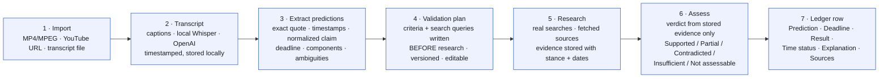
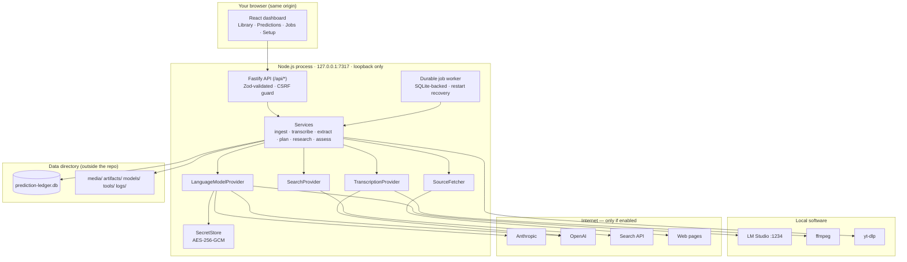

# Prediction Ledger

**Import a video. Find the predictions it makes. Write the test before looking at the answer. Research what actually happened. Keep the receipts.**

Prediction Ledger is an open-source, localhost-only application. It takes a local MP4/MPEG file, a YouTube URL, or an existing transcript, produces a timestamped transcript, extracts the forward-looking claims the speaker made, generates an inspectable **validation plan** for each claim *before* any research happens, runs real web searches, stores the evidence, and records a two-part verdict — evidence assessment and time status — with citations and history.

Everything lives on your computer in a SQLite database. Cloud AI providers and web research are opt-in and clearly labelled; a fully local workflow (LM Studio + local Whisper + transcript import) is supported.

> **Status:** Release 0.4 — Milestone 3. Drop a local MP4/MPEG (or audio) file: ffmpeg extracts the audio, a local Whisper engine (Transformers.js, optional install) or OpenAI transcribes it in resumable chunks with continuous timestamps, and the full analysis loop from 0.2–0.3 runs on the result: extract predictions → versioned validation plan → real web research → verified evidence → two-field verdict with citations, recheck history, JSON/CSV export. YouTube (0.5) is next. See [docs/BUILD_PLAN.md](docs/BUILD_PLAN.md) and the [worked example](docs/WORKED_EXAMPLE.md).

---

## Contents

- [How it works](#how-it-works)
- [Quick start](#quick-start)
- [First run checklist](#first-run-checklist)
- [How it is engineered](#how-it-is-engineered)
- [Repository layout](#repository-layout)
- [Documentation](#documentation)
- [Privacy and what leaves your machine](#privacy-and-what-leaves-your-machine)
- [Roadmap](#roadmap)
- [Contributing](#contributing)
- [Attribution and license](#attribution-and-license)

---

## How it works



Two principles run through the whole design:

1. **Write the test before the answer.** Step 4 is a separate, inspectable, versioned artifact. Each research run is bound to the exact plan version it used, so the criteria cannot be quietly rewritten to fit what was found.
2. **The model's memory is not evidence.** Only pages the application actually retrieved can be cited. If search fails or the web is silent, the result is *Insufficient evidence* — never a verdict.

A useful mental model: it is a **courtroom, not a pundit**. Extraction is the clerk, the validation plan is the judge's instructions written before testimony, research is discovery, assessment is the verdict, and the full record is kept.

---

## Quick start

**Prerequisites:** [Node.js 24 LTS](https://nodejs.org) (22.13+ works) and Git or [GitHub Desktop](https://desktop.github.com). Add [ffmpeg](docs/SETUP.md#1-prerequisites) if you want to import video/audio files (transcript import needs nothing extra). No admin rights, no Docker, no Python.

```bash
# 1. Clone (or use GitHub Desktop → File → Clone repository)
git clone https://github.com/bitsbetrippin/prediction-ledger.git
cd prediction-ledger

# 2. Check environment, install dependencies, build
npm run setup

# 3. Run — opens http://127.0.0.1:7317 in your browser
npm start
```

Stop with **Ctrl+C**. The server only ever listens on `127.0.0.1` (loopback); it is not reachable from other devices.

| Command | What it does |
|---|---|
| `npm run setup` | Verifies Node version, reports optional tools (ffmpeg, yt-dlp), installs dependencies, builds everything. |
| `npm start` | Normal mode: starts the built server and opens the dashboard. |
| `npm run dev` | Developer mode: server with auto-reload + Vite dev server on `127.0.0.1:5173`. |
| `npm test` | Runs the test suite (`node:test`). |
| `npm run build` / `npm run clean` | Rebuild / remove build output (never touches your data). |

Platform-specific commands, LM Studio setup, external tools, and troubleshooting: **[docs/SETUP.md](docs/SETUP.md)**.

---

## First run checklist

1. `npm start` → the dashboard opens on the **Setup** tab.
2. Decide on **Privacy → Allow internet access** (on for cloud providers/research; off for a fully local workflow).
3. Enable a provider and **Test connection**:
   - **Anthropic** or **OpenAI**: paste an API key; the test lists your models.
   - **LM Studio** (local): start its server in the *Developer* tab, load a model, then test. Step-by-step in [docs/SETUP.md §4.3](docs/SETUP.md#43-lm-studio-local-model--manual-steps-required).
4. Under **Which model does what**, choose a provider for extraction, validation-plan generation, and assessment (they can differ).
5. **Save settings.** Keys are encrypted at rest and never shown again — only a masked hint like `sk-ant-…4f2a`.
6. Pick a **Web search** provider (Brave/Tavily key, a local SearXNG URL, or Anthropic/OpenAI native search).
7. **Try it:** Library → import `fixtures/transcripts/data-center-approvals.srt` with published date `2025-11-03` → **Extract predictions** → open a prediction → **Research** (generates the plan first, then searches, reads sources, and assesses).

Where your data is: shown in the Setup tab and the page footer (`%LOCALAPPDATA%\PredictionLedger` on Windows, `~/Library/Application Support/PredictionLedger` on macOS). Override with `PL_DATA_DIR`.

---

## How it is engineered

One Node.js process, one SQLite file, a browser tab. Details and rationale in **[docs/ARCHITECTURE.md](docs/ARCHITECTURE.md)**.



| Concern | Choice | Why |
|---|---|---|
| Runtime | Node.js 24 LTS, TypeScript | One runtime on Windows/macOS; `node:sqlite` built in — no native compile step. |
| Server | Fastify 5 on `127.0.0.1` | Loopback only, schema-validated routes, redacted logs. Occupied port → walks to the next one, never kills anything. |
| Frontend | React 18 + Vite | Built once to static files served by the same process; no separate web server in normal use. |
| Database | SQLite (WAL) + forward-only migrations | Single file, crash-safe, backed up before every migration. Drizzle ORM evaluated in 0.3 (ADR-012). |
| Jobs | Rows in a `jobs` table + in-process worker | Transcription and research survive restarts; bounded retries; cancellation; dedupe. |
| Secrets | AES-256-GCM, key file with owner-only permissions | Never in the browser, logs, exports, or git. |
| Local transcription | Whisper (ONNX) inside Node via Transformers.js | Pure npm — no Python, no compiled binary. Models download once. |
| Media / YouTube | ffmpeg, yt-dlp as child processes (argument arrays, never a shell) | Documented explicitly; npm alone does not supply them. |
| Search | Replaceable `SearchProvider` (Brave first; SearXNG; Tavily; Anthropic/OpenAI native) | Only app-executed searches count as evidence. |

**Security posture in one paragraph.** Loopback binding is not treated as a security boundary: mutating requests need a custom header a cross-origin page cannot send; outbound research fetches refuse private/loopback/link-local addresses and re-check on every redirect; uploads are stored under content-hash names and validated with ffprobe; transcripts, fetched pages, and generated prompts are treated as untrusted data that cannot change budgets, tools, or verdict rules. See [ARCHITECTURE §7](docs/ARCHITECTURE.md#7-security-model).

---

## Repository layout

```
prediction-ledger/
├── package.json            npm workspaces + portable scripts (setup/build/start/dev/test/clean)
├── scripts/                cross-platform Node launchers (no bash/PowerShell required)
│   ├── start.mjs           normal mode: run built server, open browser, clean Ctrl+C
│   ├── dev.mjs             dev mode: tsx watch + Vite
│   ├── setup-check.mjs     Node version + optional tools report
│   └── clean.mjs
├── shared/                 @prediction-ledger/shared — types shared by server and dashboard
├── server/                 @prediction-ledger/server — Fastify API, SQLite, jobs, providers
│   └── src/
│       ├── index.ts        entry: loopback bind, static files, shutdown
│       ├── config.ts       OS-aware data directory, port, env vars
│       ├── context.ts      composition root
│       ├── settings.ts     Zod-validated settings service
│       ├── db/             node:sqlite wrapper + migrations/NNN_*.sql
│       ├── security/       SecretStore (AES-GCM), CSRF guard
│       ├── jobs/           durable JobQueue
│       ├── providers/llm/  LanguageModelProvider + Anthropic / OpenAI-compatible adapters
│       ├── transcripts/    SRT / VTT / TXT / JSON parsers
│       ├── analysis/       windowing, quote locator, date resolver, dedupe, prompts, schemas, structured completion
│       ├── research/       SearchProvider adapters, guarded SourceFetcher, HTML extractor, verdict guard
│       ├── services/       videos, predictions, plans, templates, research, export (repositories)
│       ├── jobs/handlers/  prediction.extract, plan.generate, research.run, assessment.run
│       ├── routes/         /api/* (see docs/API.md)
│       └── *.test.ts       node:test suites (core, analysis, end-to-end pipeline with a fake model)
├── fixtures/               human-reviewed transcripts, expected outcomes, canned model outputs
├── web/                    @prediction-ledger/web — React + Vite dashboard
│   └── src/pages/          Library · Video · Predictions (+ detail panel) · Jobs · Setup
├── docs/
│   ├── ARCHITECTURE.md     architecture overview v1 (components, data flow, schema, security, deps)
│   ├── API.md              HTTP API contracts and job kinds
│   ├── WORKED_EXAMPLE.md   the spec's worked example, end to end, on synthetic fixtures
│   ├── BUILD_PLAN.md       requirements register, releases 0.1 → 1.0, acceptance criteria
│   ├── SETUP.md            providers, LM Studio, external tools, data directory, troubleshooting
│   ├── WIREFRAMES.md       screen mockups
│   └── DECISIONS.md        architecture decision log
├── LICENSE                 Apache-2.0
├── NOTICE                  attribution
├── THIRD_PARTY_NOTICES.md  licenses of non-original components
└── CONTRIBUTING.md
```

---

## Documentation

| Document | Read it when… |
|---|---|
| [docs/SETUP.md](docs/SETUP.md) | you are installing, configuring providers or LM Studio, or something won't start. |
| [docs/ARCHITECTURE.md](docs/ARCHITECTURE.md) | you want to understand or change how the system is built. |
| [docs/BUILD_PLAN.md](docs/BUILD_PLAN.md) | you want to know what ships in which release and how it is accepted. |
| [docs/API.md](docs/API.md) | you are calling or extending the local HTTP API. |
| [docs/WORKED_EXAMPLE.md](docs/WORKED_EXAMPLE.md) | you want to see exactly how a prediction becomes a verdict, and why cancellations alone prove nothing. |
| [docs/WIREFRAMES.md](docs/WIREFRAMES.md) | you are working on the dashboard. |
| [docs/DECISIONS.md](docs/DECISIONS.md) | you are about to reverse a design decision. |
| [CONTRIBUTING.md](CONTRIBUTING.md) | you want to submit a change. |

---

## Privacy and what leaves your machine

| You enable… | What is sent | Where |
|---|---|---|
| Anthropic or OpenAI as a text provider | transcript windows, predictions, evidence excerpts, prompts | that provider |
| OpenAI transcription | the video's audio | OpenAI |
| Brave / Tavily search | search queries from the validation plan | that provider |
| Anthropic / OpenAI native web search | queries + assessment prompt | that provider |
| Source fetching | requests to the cited websites | those sites |
| YouTube import | the URL | YouTube |
| LM Studio, SearXNG, local Whisper, transcript import | nothing | — |

Turning **Privacy → Allow internet access** off restricts the app to explicitly configured local endpoints; outcome research stays *pending* until it is turned back on. There is no telemetry.

---

## Roadmap

| Release | Delivers |
|---|---|
| **0.1** ✓ | Localhost server, Setup tab, encrypted credentials, provider tests, durable jobs, docs. |
| **0.2** ✓ | Transcript import → prediction extraction (edit/merge/split/dismiss) → versioned validation plans. |
| **0.3** ✓ | Web research, stored evidence, two-field verdicts with citations, app-enforced verdict rules, recheck history, JSON/CSV export. |
| **0.4** ✓ | Local MP4/MPEG import, ffmpeg audio extraction, chunked + resumable local Whisper / OpenAI transcription with live progress. |
| **0.5** | YouTube: captions → audio → transcript-import fallback; clear recovery paths. |
| **1.0** | Cross-provider prompt evaluations (Promptfoo), hardening, Windows + macOS verification, MVP. |

Full backlog with acceptance criteria: [docs/BUILD_PLAN.md](docs/BUILD_PLAN.md).

---

## Contributing

Issues and pull requests are welcome. Please read [CONTRIBUTING.md](CONTRIBUTING.md) — in short: keep the loopback-only and no-telemetry rules, add a fixture before changing a prompt, run `npm test`, and keep the docs in step with the commands.

---

## Attribution and license

**Original concept and product design:** Michael D. Carter — [BitsBeTrippin](https://bitsbetrippin.io).
**Engineering support:** Claude AI (Anthropic), acting as development lead with solution-architecture review roles.

Licensed under the **Apache License 2.0** — see [LICENSE](LICENSE) and [NOTICE](NOTICE). Third-party components retain their own licenses and are credited in [THIRD_PARTY_NOTICES.md](THIRD_PARTY_NOTICES.md).
