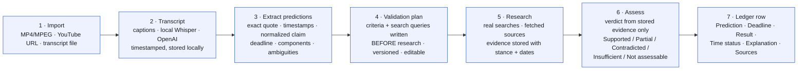
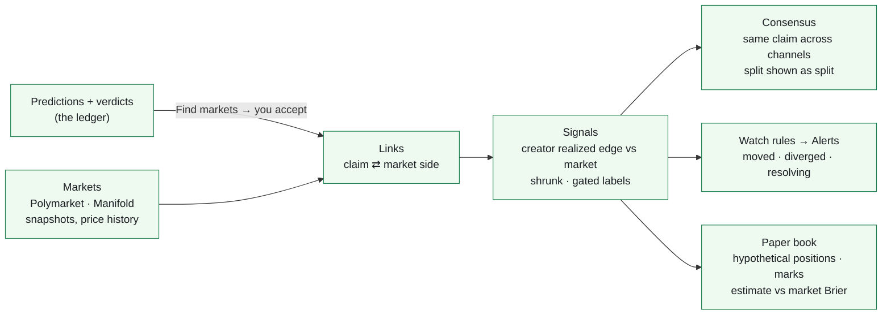
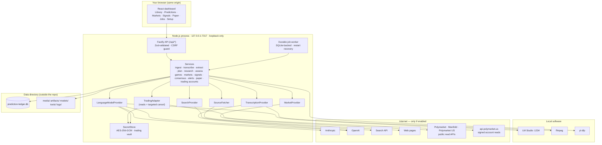

# Prediction Ledger

**Import a video. Find the predictions it makes. Write the test before looking at the answer. Research what actually happened. Keep the receipts.**

Prediction Ledger is an open-source, localhost-only application with two halves.

**The ledger.** It takes a local MP4/MPEG file, a YouTube URL (single video, playlist, or channel), or an existing transcript; produces a timestamped transcript; extracts the forward-looking claims the speaker made; writes an inspectable **validation plan** for each claim *before* any research happens; runs real web searches; stores the evidence; and records a two-part verdict — evidence assessment and time status — with citations and history. Game picks (NFL, NBA, NHL, MLB, soccer, …) take a shorter road: one look-up per matchup for *winner, score, date*, then every pick on that game settles by rule.

**The market side.** The same claims can be linked, with your approval, to prediction-market questions (Polymarket international, Manifold, and — since 1.10 — **Polymarket US**; all read-only, no account needed for data). The app keeps price snapshots, measures each channel's *realized edge* against the market price at the time it spoke, turns that into gated **signals** and cross-channel **consensus**, raises local **alerts** when the market moves against them, and keeps a **paper-trading** book that scores the whole thing. A Polymarket US account can be connected to *read* balances, positions and open orders; **no order can be placed by this build** — execution is a separate, gated track (1.11 → 2.0, see [docs/DECISIONS.md](docs/DECISIONS.md) ADR-030).

Everything lives on your computer in a SQLite database. Cloud AI providers, web research, and market data are opt-in and clearly labelled; a fully local workflow (LM Studio + local Whisper + transcript import) is supported.

> **Status: 1.10.0.** Feature-complete against the original specification (releases 0.1 → 1.1), the sports rule (1.2 → 1.4), the prediction-market plan (1.5 → 1.9, see [docs/PREDICTION_MARKETS.md](docs/PREDICTION_MARKETS.md)), and the first release of the Polymarket US track (1.10: account connection and read-only US market data — no submission path exists). 98 automated tests, all using a fake venue adapter; the one owner-run live check (`npm run trading:read-check`) is read-only and **pending owner execution**. What has actually been executed on which platform is tracked in [docs/VERIFICATION.md](docs/VERIFICATION.md) and [docs/FIRST_RUN.md](docs/FIRST_RUN.md) — releases 1.4 → 1.10 have been tested against fixtures and live public venue APIs, not yet end to end on real videos, so expect the parsers and matchers to need tuning on the first real run. Release-by-release detail: [CHANGELOG.md](CHANGELOG.md).

---

## Contents

- [How it works](#how-it-works)
- [What you can do with it](#what-you-can-do-with-it)
- [Quick start](#quick-start)
- [First run checklist](#first-run-checklist)
- [How it is engineered](#how-it-is-engineered)
- [Repository layout](#repository-layout)
- [Documentation](#documentation)
- [Privacy and what leaves your machine](#privacy-and-what-leaves-your-machine)
- [Roadmap](#roadmap)
- [Contributing](#contributing)
- [Attribution and license](#attribution-and-license)

---

## How it works



Two principles run through the whole design:

1. **Write the test before the answer.** Step 4 is a separate, inspectable, versioned artifact. Each research run is bound to the exact plan version it used, so the criteria cannot be quietly rewritten to fit what was found.
2. **The model's memory is not evidence.** Only pages the application actually retrieved can be cited. If search fails or the web is silent, the result is *Insufficient evidence* — never a verdict.

A useful mental model: it is a **courtroom, not a pundit**. Extraction is the clerk, the validation plan is the judge's instructions written before testimony, research is discovery, assessment is the verdict, and the full record is kept.

The market side sits beside the courtroom, not inside it:



Three more principles govern that side: a link is a *proposal* until you accept it (only an exact game matchup auto-links); a creator is measured by what following them would have earned at the market's price, not by hit rate; and the paper book is the only scoreboard — the application has no trading code.

---

## What you can do with it

| Area | In the dashboard | What happens underneath |
|---|---|---|
| **Import** | Library → paste a YouTube link, drop an MP4/MPEG/audio file, import an SRT/VTT/TXT/JSON transcript, or *Import a playlist or channel* (bulk, newest first, optional auto-extract). | yt-dlp (consent-installed, checksum-verified) fetches captions or audio; ffmpeg normalises audio; local Whisper (Transformers.js) or OpenAI transcribes in resumable chunks. Nothing leaves the machine for transcript imports. |
| **Extract** | Video → *Extract predictions*; edit, merge, split, accept, dismiss. | Windowed transcript → structured model output → exact quote located in the transcript, dates resolved relative to when the claim was made, compound claims split into components, repeats deduplicated. Sports Mode turns game picks into *team vs team* with the game as the deadline. |
| **Validate (general)** | Prediction → *Research* (plan is generated first; optional review stop). | Versioned validation plan → budgeted searches → guarded page fetches → evidence items whose excerpts must appear verbatim in the page → verdict from stored evidence only, with app-enforced rules (no results ≠ false, pending ≠ failed). Rechecks create new versions. |
| **Validate (sports)** | Prediction → *Validate scores*, or Predictions → *Validate all scores* for a video. | One look-up per matchup: final score and date from trusted sources (parser first, model only as a fallback reader) → a game record → every pick on that game settled by rule: Hit / Miss / Push. |
| **Markets** | Prediction → *Markets* → *Find markets*; accept or reject proposals; Markets page to search venues and watch questions. | Deterministic matching (teams + date + pick type for sports; term overlap, entities, numbers, deadlines for general claims) with model relation labels; snapshots on a schedule; the venue's price on the day the claim was made from price history. |
| **Signals** | Signals page: market sides, estimates, edges, labels, creator records; expand a row for the why. | Realized edge per creator = mean(outcome − market price at made) over settled linked claims, shrunk by n/(n+k); combined per market side, one contribution per video; label only when record, edge, liquidity and deadlines clear the gates. |
| **Consensus & alerts** | Signals → *Consensus across channels*; alerts list with a nav badge. | Same claim grouped by linked market or by statement overlap, weighted by record × recency, splits shown as splits. Watch rules after every snapshot: moved, diverged, resolving soon. |
| **Paper trading** | Paper page; *Paper buy* on a Signals row; optional auto-open. | Hypothetical positions at the snapshot price, fixed or fractional-Kelly stakes, marked at every refresh, closed at 1/0 on venue resolution; estimate Brier vs market Brier. Never touches a venue account. |
| **Polymarket US account (1.10)** | Setup → *Polymarket US account*: paste key ID + secret from the developer portal, *Test connection*, *Save*, *Refresh account*, *Disconnect*. | Ed25519-signed reads through the pinned official SDK: balances, positions, open orders. Credentials live in a protected vault; only a fingerprint and masked hints come back. The trading mode stays *paper*; this build has no order-submission code. |
| **Keep the receipts** | JSON / CSV export; backups; job list with retry. | Export carries videos, predictions, plans, runs, sources, evidence, assessments, games, markets and links — never credentials. |

---

## Quick start

**Prerequisites:** [Node.js 24 LTS](https://nodejs.org) (22.13+ works) and Git or [GitHub Desktop](https://desktop.github.com). Add [ffmpeg](docs/SETUP.md#1-prerequisites) to import video/audio files or YouTube links; yt-dlp is installed from inside the app when you first need it (transcript import needs nothing extra). No admin rights, no Docker, no Python.

```bash
# 1. Clone (or use GitHub Desktop → File → Clone repository)
git clone https://github.com/bitsbetrippin/predictionledger.git
cd predictionledger   # the GitHub repository is "predictionledger"; the npm package and app name stay "prediction-ledger"

# 2. Check environment, install dependencies, build
npm run setup

# 3. Run — opens http://127.0.0.1:7317 in your browser
npm start
```

Stop with **Ctrl+C**. The server only ever listens on `127.0.0.1` (loopback); it is not reachable from other devices.

| Command | What it does |
|---|---|
| `npm run setup` | Verifies Node version, reports optional tools (ffmpeg, yt-dlp), installs dependencies, builds everything. |
| `npm start` | Normal mode: starts the built server and opens the dashboard. |
| `npm run dev` | Developer mode: server with auto-reload + Vite dev server on `127.0.0.1:5173`. |
| `npm test` | Runs the test suite (`node:test`). |
| `npm run doctor` | Prints an environment report (Node, ffmpeg, yt-dlp, data directory, port) to paste into an issue — no secrets. |
| `npm run backup` | Writes a consistent copy of the database + secret key into the data directory's `backups/`. |
| `npm run eval` | Runs the Promptfoo prompt evaluations against real providers (needs keys; see `evals/README.md`). |
| `npm run markets -- search "…"` | Read-only probe of the Polymarket public API (also `tag`, `market`, `book`) — no account needed. |
| `npm run typecheck` | Type-checks every workspace without emitting. |
| `npm run build` / `npm run clean` | Rebuild / remove build output (never touches your data). |

Platform-specific commands, LM Studio setup, external tools, and troubleshooting: **[docs/SETUP.md](docs/SETUP.md)**.

---

## First run checklist

1. `npm start` → the dashboard opens on the **Setup** tab.
2. Decide on **Privacy → Allow internet access** (on for cloud providers/research; off for a fully local workflow).
3. Enable a provider and **Test connection**:
   - **Anthropic** or **OpenAI**: paste an API key; the test lists your models.
   - **LM Studio** (local): start its server in the *Developer* tab, load a model, then test. Step-by-step in [docs/SETUP.md §4.3](docs/SETUP.md#43-lm-studio-local-model--manual-steps-required).
4. Under **Which model does what**, choose a provider for extraction, validation-plan generation, and assessment (they can differ).
5. **Save settings.** Keys are encrypted at rest and never shown again — only a masked hint like `sk-ant-…4f2a`.
6. Pick a **Web search** provider (Brave/Tavily key, a local SearXNG URL, or Anthropic/OpenAI native search).
7. **Try it:** Library → import `fixtures/transcripts/data-center-approvals.srt` with published date `2025-11-03` → **Extract predictions** → open a prediction → **Research** (generates the plan first, then searches, reads sources, and assesses).
8. **Sports:** turn on **Sports Mode** in Setup, import a picks video, then **Validate all scores** on the Predictions page.
9. **Markets (optional):** leave **Prediction markets** enabled (default), open a prediction → **Markets** → **Find markets**, accept the right proposal, then watch the **Signals** and **Paper** pages fill in as snapshots accumulate.

Where your data is: shown in the Setup tab and the page footer (`%LOCALAPPDATA%\PredictionLedger` on Windows, `~/Library/Application Support/PredictionLedger` on macOS). Override with `PL_DATA_DIR`.

---

## How it is engineered

One Node.js process, one SQLite file, a browser tab. Details and rationale in **[docs/ARCHITECTURE.md](docs/ARCHITECTURE.md)**.



| Concern | Choice | Why |
|---|---|---|
| Runtime | Node.js ≥ 22.13 (24 LTS recommended; runs on 26), TypeScript | One runtime on Windows/macOS; `node:sqlite` built in — no native compile step. |
| Server | Fastify 5 on `127.0.0.1` | Loopback only, schema-validated routes, redacted logs. Occupied port → walks to the next one, never kills anything. |
| Frontend | React 18 + Vite | Built once to static files served by the same process; no separate web server in normal use. |
| Database | SQLite (WAL) + forward-only migrations (001 → 012) | Single file, crash-safe, backed up before every migration. Drizzle ORM evaluated in 0.3 (ADR-012). |
| Jobs | Rows in a `jobs` table + in-process worker | Transcription, research, score look-ups, market matching and snapshots survive restarts; bounded retries; cancellation; dedupe keys. |
| Secrets | AES-256-GCM, key file with owner-only permissions; `trading.*` names readable only through a vault handle held by the trading service | Never in the browser, logs, exports, or git; model/search code cannot reach venue credentials. Portable backups omit them. |
| Local transcription | Whisper (ONNX) inside Node via Transformers.js | Pure npm — no Python, no compiled binary. Models download once. |
| Media / YouTube | ffmpeg, yt-dlp as child processes (argument arrays, never a shell) | Documented explicitly; npm alone does not supply them. |
| Search | Replaceable `SearchProvider` (Brave first; SearXNG; Tavily; Anthropic/OpenAI native) | Only app-executed searches count as evidence. |
| Sports settlement | Code-written plan, deterministic score/date parsers, rule settlement (`analysis/sports.ts`) | A final score is a fact, not a judgement; the model only reads pages the parser could not. |
| Markets | Replaceable `MarketProvider` (Polymarket, Manifold, Polymarket US) — read-only, unauthenticated | Snapshots and price history stored locally; links are proposals; US records carry the venue's contract constraints (tick, min quantity, fee coefficient, durable side ids). |
| Polymarket US account | Separate `TradingAdapter` (`providers/trading/`) behind the pinned official `polymarket-us@0.1.1` SDK; fake adapter in every test | Reads + targeted cancel only in 1.10 — no create/preview method exists; hosts are fixed; live modes are refused until their release gates (ADR-030/031). |
| Signals | Pure functions with fixture tests (`analysis/signals.ts`); computed on read | Realized edge, shrinkage and gates are inspectable numbers, not a model opinion. |

**Security posture in one paragraph.** Loopback binding is not treated as a security boundary: mutating requests need a custom header a cross-origin page cannot send; outbound research fetches refuse private/loopback/link-local addresses and re-check on every redirect; uploads are stored under content-hash names and validated with ffprobe; transcripts, fetched pages, and generated prompts are treated as untrusted data that cannot change budgets, tools, or verdict rules. See [ARCHITECTURE §7](docs/ARCHITECTURE.md#7-security-model).

---

## Repository layout

```
prediction-ledger/
├── package.json              npm workspaces + portable scripts (setup/build/start/dev/test/test:trading/typecheck/clean/doctor/backup/markets/trading:read-check/eval)
├── scripts/                  cross-platform Node launchers (no bash/PowerShell required)
│   ├── start.mjs             normal mode: run built server, open browser, clean Ctrl+C
│   ├── dev.mjs               dev mode: tsx watch + Vite
│   ├── setup-check.mjs       Node version + optional tools report
│   ├── doctor.mjs            environment report for issues (no secrets)
│   ├── backup.mjs            consistent DB + key backup
│   ├── markets-probe.mjs     read-only Polymarket probe (search / tag / market / book)
│   ├── polymarket-us-read-check.mjs  opt-in, owner-run, read-only US account check (credentials from env vars)
│   ├── copy-migrations.mjs   ships .sql migrations into server/dist
│   └── clean.mjs
├── shared/                   @prediction-ledger/shared — types shared by server and dashboard
├── server/                   @prediction-ledger/server — Fastify API, SQLite, jobs, providers
│   └── src/
│       ├── index.ts          entry: loopback bind, static files, market refresh timer, shutdown
│       ├── config.ts         OS-aware data directory, port, env vars
│       ├── context.ts        composition root (services + job handlers)
│       ├── settings.ts       Zod-validated settings service (providers, stages, transcription, sports, markets, watch, paper…) — never the trading mode
│       ├── db/               node:sqlite wrapper + migrations/001_init … 012_trading.sql
│       ├── security/         SecretStore (AES-GCM, protected trading vault), CSRF guard, redaction
│       ├── jobs/             durable JobQueue
│       │   └── handlers/     extract · plan · research · assess · media · game (sports) · markets (match/snapshot/backfill) · watch
│       ├── providers/
│       │   ├── llm/          LanguageModelProvider: Anthropic, OpenAI-compatible (OpenAI, LM Studio)
│       │   ├── markets/      MarketProvider: Polymarket, Manifold, Polymarket US (read-only) + registry
│       │   └── trading/      TradingAdapter: Polymarket US (pinned SDK; reads + targeted cancel), fake adapter, credentials, registry
│       ├── media/            ffmpeg wrapper, local upload importer, Whisper / OpenAI transcription
│       ├── youtube/          yt-dlp wrapper, single-video importer, playlist/channel importer
│       ├── transcripts/      SRT / VTT / TXT / JSON parsers
│       ├── analysis/         windowing, quote locator, date resolver, dedupe, prompts, schemas, structured completion,
│       │                     sports (score/date parsers, settlement), markets (matching), signals (edge, shrinkage, gates)
│       ├── research/         SearchProvider adapters, guarded SourceFetcher, HTML extractor, verdict guard
│       ├── services/         videos, predictions, plans, templates, research, games, markets, signals, consensus, alerts, paper, tradingAccounts, backup, export
│       ├── routes/           /api/* — content, research, media, youtube, markets (+ signals, consensus, alerts, paper), trading; see docs/API.md
│       └── **/*.test.ts      node:test suites (98): core, analysis, sports, markets, signals, watch/consensus, paper, trading (fake venue), media, youtube, pipelines
├── fixtures/                 human-reviewed transcripts (incl. a 30-minute one and NFL picks), expected outcomes, canned model outputs, research pages,
│                             trading/ (captured public Polymarket US responses + synthetic account shapes; no credentials)
├── evals/                    Promptfoo configuration, prompts and assertions for the extraction/plan/assessment templates
├── web/                      @prediction-ledger/web — React + Vite dashboard
│   └── src/
│       ├── pages/            Library · Video · Predictions · Markets · Signals · Paper · Jobs · Setup
│       └── components/       PredictionDetail (quote, components, plan, evidence, history, Markets tab) · MarketLinks · PolymarketUsCard
├── docs/                     see the table below
├── LICENSE                   Apache-2.0
├── NOTICE                    attribution
├── THIRD_PARTY_NOTICES.md    licenses of non-original components
└── CONTRIBUTING.md
```

---

## Documentation

| Document | Read it when… |
|---|---|
| [docs/SETUP.md](docs/SETUP.md) | you are installing, configuring providers or LM Studio, or something won't start. |
| [docs/ARCHITECTURE.md](docs/ARCHITECTURE.md) | you want to understand or change how the system is built. |
| [docs/BUILD_PLAN.md](docs/BUILD_PLAN.md) | you want to know what ships in which release and how it is accepted. |
| [docs/API.md](docs/API.md) | you are calling or extending the local HTTP API. |
| [docs/WORKED_EXAMPLE.md](docs/WORKED_EXAMPLE.md) | you want to see exactly how a prediction becomes a verdict, and why cancellations alone prove nothing. |
| [docs/WIREFRAMES.md](docs/WIREFRAMES.md) | you are working on the dashboard. |
| [docs/DECISIONS.md](docs/DECISIONS.md) | you are about to reverse a design decision. |
| [docs/FIRST_RUN.md](docs/FIRST_RUN.md) | you are running the app for the first time on a new machine and want to report back what to fix. |
| [docs/VERIFICATION.md](docs/VERIFICATION.md) | you want to know what has actually been executed on which platform. |
| [docs/PREDICTION_MARKETS.md](docs/PREDICTION_MARKETS.md) | you want to understand the market side: what Polymarket, Manifold and Polymarket US expose, the ground rules, and how 1.5 → 1.10 were built. |
| [CHANGELOG.md](CHANGELOG.md) | you want the release-by-release history. |
| [CONTRIBUTING.md](CONTRIBUTING.md) | you want to submit a change. |

---

## Privacy and what leaves your machine

| You enable… | What is sent | Where |
|---|---|---|
| Anthropic or OpenAI as a text provider | transcript windows, predictions, evidence excerpts, prompts | that provider |
| OpenAI transcription | the video's audio | OpenAI |
| Brave / Tavily search | search queries from the validation plan | that provider |
| Anthropic / OpenAI native web search | queries + assessment prompt | that provider |
| Source fetching | requests to the cited websites | those sites |
| YouTube import (single video, playlist, or channel) | the URL(s) | YouTube |
| Prediction markets | search terms and market ids (never your predictions or keys) | Polymarket / Manifold / Polymarket US public APIs |
| Polymarket US account (connected) | Ed25519-signed read requests (balances, positions, open orders); the key ID travels as a header, the secret never leaves the machine | `api.polymarket.us` only |
| LM Studio, SearXNG, local Whisper, transcript import, paper trading | nothing | — |

Turning **Privacy → Allow internet access** off restricts the app to explicitly configured local endpoints; outcome research stays *pending* until it is turned back on. There is no telemetry.

---

## Roadmap

Delivered, in order:

| Release | Delivers |
|---|---|
| **0.1** ✓ | Localhost server, Setup tab, encrypted credentials, provider tests, durable jobs, docs. |
| **0.2** ✓ | Transcript import → prediction extraction (edit/merge/split/dismiss) → versioned validation plans. |
| **0.3** ✓ | Web research, stored evidence, two-field verdicts with citations, app-enforced verdict rules, recheck history, JSON/CSV export. |
| **0.4** ✓ | Local MP4/MPEG import, ffmpeg audio extraction, chunked + resumable local Whisper / OpenAI transcription with live progress. |
| **0.5** ✓ | YouTube: consent-installed yt-dlp, captions → audio → transcript-import fallback, distinct unavailable-video messages, up-front privacy refusal. |
| **0.6** ✓ | 30-minute labelled fixture + acceptance tests, Promptfoo suite, provider timeouts/backoff, job retry, backups, release scaffolding. |
| **1.1.0** ✓ | Model download job + progress, model timeout setting, security tests, `npm run doctor`, first-run runbook, first real-machine build fixes. |
| **1.2.0** ✓ | Sports picks: extraction rule, game-date deadlines, deterministic settlement plan, capped look-ups, settlement verdicts, dashboard chip and filter. |
| **1.3.x** ✓ | Sports Mode switch, one-click **Validate scores** from trusted box-score sources, point-spread toggle, Hit/Miss/Push labels; schedule look-up for unknown game dates. |
| **1.4.0** ✓ | Game records: one look-up per matchup (winner, score, date), deterministic score reader, every pick settled by rule, **Validate all scores**. |
| **1.5.0** ✓ | Prediction markets: `MarketProvider` interface, read-only Polymarket adapter, probe script, `/api/markets` routes, integration framework. |
| **1.6.0** ✓ | Markets in the ledger: stored markets + snapshots, proposal-only links (exact sports matchups auto-link), Markets tab and page, scheduled refresh. |
| **1.7.0** ✓ | Signals: venue price history at the time of the claim, creator records with realized edge, shrunk estimates, gated labels, Signals page. |
| **1.8.0** ✓ | Playlist/channel bulk import with auto-extract, consensus across channels, watch rules with local alerts, Manifold as a second venue. |
| **1.9.0** ✓ | Paper trading: hypothetical positions (manual or auto on labelled signals), fixed / fractional-Kelly sizing, marks, resolution close, estimate-vs-market Brier. |
| **1.10.0** ✓ | Polymarket US foundation: distinct `polymarket_us` market provider with contract constraints, separate read-only trading adapter (pinned SDK), account connection with masked credentials and local binding, protected credential vault, portable backups, policy row that a settings save cannot arm, dated ADRs answering the integration questions. No submission path. |

The Polymarket US execution track (proposed specification, September 2026) continues gate by gate — each release depends on the previous one passing its acceptance tests, and live features stay disabled until then:

| Release | Delivers | Gate |
|---|---|---|
| **1.11.0** | Source subscriptions with provenance; execution-specific contract verification (exact event, rules hash, line, period, side) — accepted links stay research-only until verified. | Every adversarial near-match blocked. |
| **1.12.0** | Immutable forecasts (versioned estimator), pure trade/no-trade decisions with reason codes, atomic budget reservations, execution-aware US paper engine. | Leakage, duplicate-source and budget-concurrency tests. |
| **1.13.0** | Manual-live execution: preview → one bounded IOC order → reconciliation; NO-price conversion tested; `submission_unknown` handling. Owner-run capped smoke test only. | Timeout/crash/partial-fill drills, no duplicate orders. |
| **1.14.0** | Bounded automatic decisions behind explicit arming and a policy hash; Trades dashboard; emergency stop. | Source-to-order end-to-end and soak tests. |
| **2.0.0** | Upgrade/restore drills, Windows verification on real content, qualification evidence. | No open P0/P1; insufficient calibration data = auto-live gate unmet. |

Other next steps: first end-to-end run of 1.4 → 1.10 on real videos and real venue pages (parser and matcher tuning); the owner-run read-only account check; per-speaker creator records once diarisation exists; per-venue paper books; the remaining first-run verification in [docs/FIRST_RUN.md](docs/FIRST_RUN.md) on Windows and macOS.

Full backlog with acceptance criteria: [docs/BUILD_PLAN.md](docs/BUILD_PLAN.md).

---

## Contributing

Issues and pull requests are welcome. Please read [CONTRIBUTING.md](CONTRIBUTING.md) — in short: keep the loopback-only and no-telemetry rules, add a fixture before changing a prompt, run `npm test`, and keep the docs in step with the commands.

---

## Attribution and license

**Original concept and product design:** Michael D. Carter — [BitsBeTrippin](https://bitsbetrippin.io).
**Engineering support:** Claude AI (Anthropic), acting as development lead with solution-architecture review roles.

Licensed under the **Apache License 2.0** — see [LICENSE](LICENSE) and [NOTICE](NOTICE). Third-party components retain their own licenses and are credited in [THIRD_PARTY_NOTICES.md](THIRD_PARTY_NOTICES.md).
