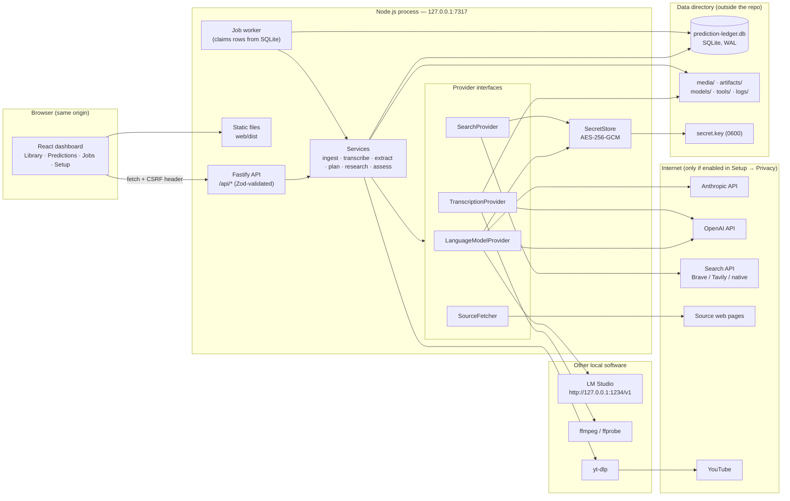
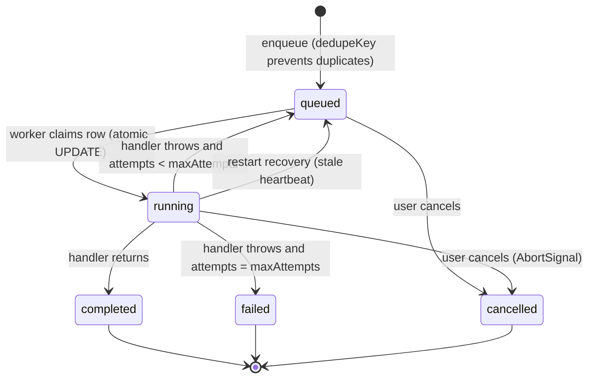

# Prediction Ledger — Architecture Overview v1 (ov1)

| | |
|---|---|
| **Status** | Approved baseline for Release 0.1 → MVP 1.0 |
| **Date** | 2026-09-11 |
| **Original concept** | Michael D. Carter (BitsBeTrippin) |
| **Engineering support** | Claude AI (development lead + agent-role reviews) |
| **Scope** | Localhost-only application. No cloud hosting, no remote database, no telemetry. |

This document is the engineering "map" of Prediction Ledger. It explains what runs, where data lives, how the pieces talk to each other, and why each major choice was made. `docs/BUILD_PLAN.md` explains *when* each piece is built.

---

## 1. What the application does

Prediction Ledger turns a video into an auditable ledger of the predictions it contains and what actually happened afterwards.

```
Import video ─► Transcript ─► Predictions ─► Validation plan ─► Web research ─► Assessment ─► Ledger row
   (file /       (captions /    (LLM          (LLM writes the     (real searches,   (LLM judges     (dashboard:
   YouTube /     Whisper /       extraction,   evaluation          fetched pages,    ONLY the        prediction |
   transcript)   import)         user edits)   criteria BEFORE     stored evidence)  stored          deadline | result
                                               any research)                         evidence)       | explanation | sources)
```

Two rules shape everything downstream:

1. **The evaluation criteria are written before the evidence is gathered, and are versioned.** A research run is always bound to the exact plan version it used. The plan cannot be quietly rewritten to fit the findings.
2. **The model's memory is never evidence.** Only content the application actually retrieved through its own search and fetch adapters can be cited. A search failure produces *insufficient evidence*, never a verdict.

An analogy that holds up well: the app is a **courtroom, not a pundit**. Extraction is the clerk recording what was said; the validation plan is the judge's instructions to the jury written before testimony; research is discovery; assessment is the verdict — and the whole transcript of proceedings is kept.

---

## 2. Application type and stack decision

### 2.1 Options considered

| Option | Fit | Why not chosen as primary |
|---|---|---|
| **A. Node.js + TypeScript, browser dashboard on localhost** *(chosen)* | One runtime for backend, frontend tooling, and job worker. `node:sqlite` is built in (no native compile). Whisper can run in-process via ONNX. yt-dlp accepts Node as its JavaScript runtime. | — |
| B. Python backend (FastAPI) + browser dashboard | Best-in-class ML tooling (faster-whisper, CTranslate2). | Two runtimes to install and keep in sync on Windows/macOS; Python environment management is the single largest source of "it doesn't run on my machine" for non-developer users. |
| C. Desktop shell (Electron/Tauri) | Native file dialogs, single icon to click. | Adds packaging, code-signing, and auto-update surface that an individual maintainer must carry. Deferred: the browser dashboard can be wrapped later without changing the backend. |

### 2.2 Selected stack (verified against official docs on 2026-09-11)

| Layer | Choice | Version guidance | Notes |
|---|---|---|---|
| Runtime | **Node.js** | ≥ 22.13 required; **24 LTS recommended** (26 enters LTS Oct 2026) | `node:sqlite` is available without flags since 22.13 and is "Release Candidate" stability in 26.8. |
| Language | **TypeScript** (strict) | 5.6+ | Shared types package keeps server and browser contracts identical. |
| HTTP server | **Fastify 5** | | Loopback-only. Schema-validated routes, structured logging with redaction, static file serving. |
| Frontend | **React 18 + Vite 5** | | Built once to static files served by Fastify (normal mode). Vite dev server with `/api` proxy (dev mode). No CSS framework; system fonts; light/dark aware. |
| Database | **SQLite via `node:sqlite`** | | WAL mode, foreign keys on. Forward-only SQL migrations. **Drizzle ORM** (`drizzle-orm/node-sqlite`, officially supported) is adopted in Milestone 1 when the content schema lands; Drizzle-Kit generates the SQL files our runner applies. |
| Validation | **Zod** | 3.x | Every request body and every model response is parsed before use. |
| Jobs | **In-process worker over a SQLite `jobs` table** | | No Redis, no second process. Survives restarts. |
| LLM adapters | Thin `fetch` adapters (R0.1) → **Vercel AI SDK** for structured output (M1) | | The app's own `LanguageModelProvider` interface is the boundary; the SDK is an implementation detail behind it. Model discovery and connection tests stay on plain `fetch` because the SDK does not list models. |
| Transcription | **`@huggingface/transformers` (Transformers.js) running Whisper ONNX in Node** | 3.x | Pure-npm, no Python, no compiled binary. Models download once (~150 MB–1 GB) into the data directory. **whisper.cpp** stays on the roadmap as an optional faster engine. |
| Media | **ffmpeg / ffprobe** | user-installed *or* `ffmpeg-static` npm | Audio extraction/normalization to 16 kHz mono WAV. Not supplied by npm alone unless `ffmpeg-static` is chosen (GPL binary — see THIRD_PARTY_NOTICES). |
| YouTube | **yt-dlp** standalone binary | latest | Requires a JavaScript runtime for full format support — **Node ≥ 20 qualifies**, so no Deno install is needed. Downloaded on first use into the data directory after user consent. |
| Search | **`SearchProvider` adapter**: Brave (first), SearXNG (self-hosted), Tavily, Anthropic native web search, OpenAI native web search | | Brave no longer has a free tier (metered from Feb 2026, $5/1k with $5 monthly credit). Provider-native search costs ~$10/1k searches on both Anthropic and OpenAI. All numbers change; the Setup tab shows the user what will be billed by whom. |
| Page extraction | **@mozilla/readability + linkedom** | | Cleaned article text for evidence; hard limits on size/time; SSRF guard (§7.4). |
| Prompt evaluation | **Promptfoo** (dev-time only) | | Regression suite over labeled fixtures for extraction, plan generation, and assessment; not shipped in the runtime. |

### 2.3 Tradeoffs accepted

- **CPU-only Whisper in Node is slower than native whisper.cpp** (roughly real-time to 3× real-time on a laptop for `whisper-base`). Accepted for MVP because it removes an entire class of install failures; users with long videos can use YouTube captions or the OpenAI transcription API, and whisper.cpp can be added as an engine later without schema changes.
- **`node:sqlite` is RC, not final.** Accepted because the API surface we use (`DatabaseSync.exec/prepare/run/get/all`) has been stable across 22→26, and the wrapper in `server/src/db/index.ts` isolates the driver.
- **Fastify + React + Vite is more machinery than a hand-rolled server** — but it is the machinery an individual maintainer can find answers for, and it is what the project's implementation context specifies.

---

## 3. Component and process view



**Process boundaries.** There is exactly one long-lived process the application owns: the Node server. ffmpeg and yt-dlp are short-lived child processes spawned with argument arrays (never a shell string). LM Studio is a separate program the user runs; the app only talks to it over HTTP on an address the user typed into Setup.

**Communication paths.** Browser ↔ server is same-origin HTTP/JSON (long operations are polled through `/api/jobs/:id`; a Server-Sent-Events stream for live progress is planned for Milestone 3). Server ↔ providers is outbound HTTPS or loopback HTTP. Nothing listens on anything except `127.0.0.1`.

---

## 4. Runtime modes and lifecycle

### 4.1 Normal mode (`npm start`)

`scripts/start.mjs` → spawns `node server/dist/index.js` → server applies migrations, starts the job worker, binds `127.0.0.1:7317` (walks forward to 7326 if busy; never kills other processes), prints `PREDICTION_LEDGER_READY http://127.0.0.1:7317` → launcher opens the default browser → Ctrl+C sends SIGINT → worker aborts running jobs (they are re-queued on next start), Fastify closes, SQLite closes.

### 4.2 Development mode (`npm run dev`)

`tsx watch` runs the server from source with `PL_DEV=1`; Vite serves the dashboard on `127.0.0.1:5173` and proxies `/api`. Same data directory as normal mode unless `PL_DATA_DIR` is set.

### 4.3 Environment variables (the only out-of-band configuration)

| Variable | Default | Purpose |
|---|---|---|
| `PL_PORT` | `7317` | First port to try. |
| `PL_DATA_DIR` | OS app-data folder (§5.1) | Where the database, media, models, tools, and logs live. |
| `PL_LOG_LEVEL` | `info` | Fastify/pino level. |
| `PL_NO_OPEN` | unset | `1` = don't open the browser on start. |
| `PL_DEV` | unset | Set by `npm run dev`; enables the Vite origin in the CSRF allow-list. |

Everything else (API keys, models, limits) is configured in the Setup tab and stored in the database.

### 4.4 Upgrades

`git pull` (or download a release) → `npm run setup` → `npm start`. Migrations are forward-only and run automatically at startup; before applying any pending migration the server copies `prediction-ledger.db` to `backups/<timestamp>.db` (Milestone 1). User data is never inside the repository, so upgrading the code cannot touch it.

### 4.5 Durable job lifecycle



Job kinds (added release by release): `video.import`, `audio.extract`, `transcript.generate`, `prediction.extract`, `plan.generate`, `research.run`, `assessment.run`. Every job records progress (0–100) and a human stage label ("Transcribing chunk 3 of 12") that the dashboard shows verbatim.

---

## 5. Data

### 5.1 Data directory (never inside the repo)

| OS | Location |
|---|---|
| Windows | `%LOCALAPPDATA%\PredictionLedger\` |
| macOS | `~/Library/Application Support/PredictionLedger/` |
| Linux | `$XDG_DATA_HOME/prediction-ledger/` or `~/.local/share/prediction-ledger/` |

```
PredictionLedger/
├── prediction-ledger.db      SQLite database (+ -wal, -shm while running)
├── secret.key                32-byte key protecting stored API keys (owner-only permissions)
├── media/                    imported/copied video files (by content hash)
├── artifacts/                extracted audio, transcript chunks, fetched page snapshots
├── models/                   Whisper ONNX models (downloaded once)
├── tools/                    yt-dlp binary (downloaded once, after consent)
├── backups/                  pre-migration database copies
└── logs/                     rolling server logs (secrets redacted)
```

### 5.2 Target schema (entity view)

Release 0.1 ships `settings`, `secrets`, `jobs`, `schema_migrations`. The content tables below arrive with their milestones; this is the agreed target so that early decisions do not paint later ones into a corner.


Design rules baked into the schema:

- **Immutability where it matters.** `predictions.quote_exact` and `transcript_segments.text_original` are never updated; corrections live in `text_corrected` and `prediction_revisions`.
- **Every assessment is traceable** to a prediction version, a plan version, a research run (hence an evidence set), a provider/model, and a research date.
- **Deletion is cascading and explicit.** Deleting a video deletes its segments, predictions, plans, runs, evidence links, and media/artifact files; `sources` rows are reference-counted and removed when orphaned.
- **Exports** (JSON, CSV) come from these tables only; `secrets` is never joined into an export path.
- **Indexes**: `(video_id, seq)` on segments; `(video_id, user_status)` and `deadline_date` on predictions; `(prediction_id, version)` unique on plans; `(status, created_at)` on jobs; `canonical_url` unique on sources.
- **1.12 additions (migration 014).** `markets.resolved_at`; `contract_verifications.prior_status`; `paper_positions.method`; `trading_policy.policy_version/limits_json/budget_timezone/policy_hash`; tables `forecast_snapshots` (immutable), `forecast_contributions`, `strategy_qualifications` (source production|fixture), `trade_decisions`, `risk_reservations`, `trade_intents`, `trade_opportunities` (PRIMARY KEY account/provider/contract), `paper_us_book`, `paper_us_positions`, `paper_us_fills`, `settlement_events`. Decision-lineage tables deliberately carry no cascading foreign keys to predictions/videos/markets.
- **1.11 additions (migration 013).** `videos`: `channel_id`, `published_precision`, `first_seen_at`, `transcript_hash`, `subscription_id`. `predictions`: `quote_hash`, `transcript_hash`, `analysis_version`. `sources`: `first_seen_at`, `status` (`available|withdrawn|missing`), `status_changed_at`, `status_note`, `independence_group`, `last_checked_at`, `last_http_status`. `research_runs`: `purpose` (`verdict|forecast`), `cutoff_at`. New tables `source_subscriptions` (unique canonical `url`), `subscription_runs`, `contract_verifications` (unique `(link_id, version)`; status CHECK; JSON checklist and facts; rules/quote hashes; stale fields); `prediction_market_links.verification_status` (default `unverified`) and `verification_id`. All additive; earlier rows are backfilled, never rewritten.

### 5.3 Where the "untrusted content" line is

Transcripts, fetched pages, and model-generated plans are all *data*. They are inserted into prompts inside clearly delimited blocks, never concatenated into system instructions, and the application — not the prompt — decides which tools run, how many searches are allowed, and which verdict labels exist. A generated research prompt cannot raise the search budget, reach a new URL class, or add a verdict category.

---

## 6. Provider interfaces and capability matrix

Four interfaces, deliberately separate, so that no code path assumes "a model" can do everything:

```ts
interface LanguageModelProvider { testConnection(); listModels(); complete(req) }        // text ↔ text/JSON
interface TranscriptionProvider { transcribe(audioPath, opts): AsyncIterable<Segment> } // audio → timestamped segments
interface SearchProvider        { search(query, opts): SearchResult[] }                  // query → URLs + snippets
interface SourceFetcher         { fetch(url): { text, title, publishedAt, ... } }         // URL → cleaned page
```

| Capability | Anthropic | OpenAI | LM Studio (local) | Local Whisper | Brave / Tavily | SearXNG (local) |
|---|---|---|---|---|---|---|
| Text completion / JSON output | ✓ (forced tool-use) | ✓ (`response_format`) | ✓ if the loaded model supports JSON mode | — | — | — |
| Model discovery | ✓ `GET /v1/models` | ✓ `GET /v1/models` | ✓ `GET /v1/models` | fixed list | — | — |
| Transcription | — | ✓ `gpt-4o-(mini-)transcribe` | — | ✓ | — | — |
| Web search | ✓ native tool (billed per search) | ✓ native tool (billed per search) | — | — | ✓ | ✓ |
| Works offline | — | — | ✓ | ✓ | — | ✓ (if local index) |
| Sends data off-machine | transcript excerpts, predictions, evidence | same | no | no | queries only | no |

**Stage routing.** Extraction, validation-plan generation, and assessment each pick a provider/model independently (Setup → "Which model does what"). A local model can assess evidence because the app hands it the retrieved excerpts — it never needs internet access itself.

**Provider-native search** (Anthropic/OpenAI web search tools) is treated as a `SearchProvider` whose results are the tool's returned citations. They are stored like any other retrieved evidence, and the app still fetches and snapshots the cited pages where accessible.

### 6.1 Market data and the Polymarket US execution boundary (1.5 → 1.10)

Two more interfaces were added later, and they are deliberately kept apart:

```ts
interface MarketProvider { search(); get(); list(); book(); priceHistory() }               // public venue data → probabilities; never authenticated
interface TradingAdapter { balances(); positions(); openOrders(); cancelOrder() }          // 1.10: signed account READS + targeted cancel; no create/preview
```

| Venue | Provider id | Hosts | Units | Account | Can reach execution? |
|---|---|---|---|---|---|
| Polymarket (international) | `polymarket` | gamma-api / clob .polymarket.com | USDC | none | never (geo-restricted; research only) |
| Manifold | `manifold` | api.manifold.markets | mana (play money) | none | never |
| Polymarket US | `polymarket_us` | gateway.polymarket.us (public) · api.polymarket.us (signed) | USD | optional, key ID + Ed25519 secret | the only one — after the 1.11 → 1.13 gates |

Rules that hold across the whole track (ADR-030/031): records are namespaced by provider and never converted; the `TradingAdapter` is the only code that may hold a venue credential, and it takes the credential per call from the trading service, which is the only holder of the `trading.` secret vault; the official `polymarket-us` SDK is pinned and used as the signed transport only — business logic never imports SDK types; production hosts are fixed in the adapter (base-URL overrides are constructor-only, test-only); the trading mode lives in `trading_policy`, not in settings, so a settings save cannot arm anything; every automated test uses the fake adapter; LLMs never call the adapter (there is no tool for it) and never modify policy. What the adapter *cannot* do in 1.10 is the point: there is no method that creates, previews or modifies an order, so submission is impossible by construction until the release that adds it passes its gate.

### 6.2 Source provenance and the contract-verification boundary (1.11)

1.11 adds the two things later releases consume and nothing that consumes them yet.

```
subscription.poll ──▶ video.import (ordinary) ──▶ transcript_hash ──▶ prediction.extract ──▶ analysis_version, quote_hash
                                                                                   │
research.run (purpose = verdict) ──▶ assessment.run ──▶ verdict                    │
research.run (purpose = forecast) ──▶ evidence only (cutoff_at) ── never chains ───┘
sources: first_seen_at · content_hash · status · independence_group   ──▶ dossier (asOf replay, dissent)
prediction_market_links ──▶ contract_verifications (versioned, computed) ──▶ verification_status on the link
```

- **`analysis/independence.ts`** — pure: content sketch + Jaccard, publisher key, union-find grouping, `knownBy(item, asOf)`. Called by the research handler after fetching; the dossier recomputes from stored hashes when a run predates the column.
- **`analysis/contractVerification.ts`** — pure: `verifyContract({prediction, game?, market, facts?})` → field checklist + derived status + side id + cutoff; `revalidate({previous, market, prediction})` → reasons. No I/O, no SDK types, fixture-tested against exact and near-match contracts.
- **`services/contracts.ts`** — the only writer of `contract_verifications`: `findUsCandidates` (US provider only; pasted event URL), `verifyLink` (new version every time), `revalidateLink` (venue refresh when online → stale with reasons), `invalidateForPrediction` (called from every prediction edit/merge/split route). There is no code path that assigns a status: the routes for that answer 405.
- **`services/subscriptions.ts`** — canonical URL, dedupe, `classifyEntry` (known → lookback → allowlist → budget → queue), `makeSubscriptionPollHandler(ctx, lister)`; the lister is injectable so tests never run yt-dlp.
- **`services/dossier.ts`** — read-only join over evidence, sources, runs and assessments; `asOf` filtering uses `first_seen_at` (publication date only under `assumePublished`).

### 6.3 Forecasts, decisions, reservations and paper execution (1.12)

```
verified link + contract ──┐
fresh YES book ────────────┼──▶ ForecastService.build (cohort as of T, one midpoint) ──▶ forecast_snapshots (immutable, hashed)
policy limits + exposure ──┘                                                                  │
                     ┌────────────────── one SQLite transaction ──────────────────────────────┐
                     │ exposure → decide() (pure; every gate) → trade_decisions (inputs, hash) │
                     │ eligible & paper → risk_reservations + trade_intents + trade_opportunities │
                     └────────────────────────────────────────────────────────────────────────┘
                                          │ paper dispatch
                                          ▼
                     simulateIocFill(book, limit, fees) → paper_us_positions/fills; reservation consumed / released
                                          ▼ (after snapshot refresh)
                     venue resolution → settlement_events → paper position settled (win / loss / void)
```

- **`analysis/decimal.ts`** — BigInt fixed-point; every ledger amount, tick and increment alignment, with the rounding mode at the call site.
- **`analysis/forecast.ts`** — pure: `computeForecast` (§7 estimator, versioned), `validateProbabilities`, `evaluateForecasts` (Brier, calibration, baseline, coverage, drawdown, gate).
- **`analysis/tradeDecision.ts`** — pure: `decide(input)` with a supplied clock; `wirePriceFor`, `feePerContractBound`, `dailyBucket`; `decisionInputsRecord` (the immutable snapshot).
- **`analysis/paperFill.ts`** — pure: `simulateIocFill` over side-specific depth.
- **`services/forecasts.ts`**, **`services/riskReservations.ts`**, **`services/tradeDecisions.ts`**, **`services/paperUs.ts`** — the only writers of their tables; `TradingAccountService` owns the policy row and its limits/hash.
- The trading adapter is not referenced by any of these modules; a manual-live decision stops at `needs_review` here — the live path (§6.4, 1.13) starts from that stored, hashed decision.

Trust rules unchanged from §5.3 and §7.6, with two additions: model output in a research run is validated against the fetched pages (an excerpt that appears in no page is discarded; an unknown component id is dropped; a missing date stays missing) and has no path to the trading service, the policy row or settings; and a verification is a *precondition record* — it authorizes nothing by itself, and 1.12/1.13 will read it only when `verified_equivalent` and not stale.

### 6.4 Manual-live execution: preview → confirm → dispatch → reconcile → settle (1.13)

```
manual-live decision (needs_review, hashed) ──▶ ExecutionService.preview: re-decide (fresh book + account) → adapter.previewOrder → order_previews (60 s, bound to rationale hash)
                                                     │ owner confirms { previewId, decisionHash }
              T1 ┌── one transaction ──────────────────────────────────────────────────────────────────┐
                 │ intent 'reserved' + risk_reservations + trade_opportunities (PK) + preview consumed │
                 └──────────────────────────────────────────────────────────────────────────────────────┘
              T2 ┌── one transaction, committed BEFORE the POST ────────────────────────────────────────┐
                 │ policy still manual_live + authorized? dispatch lease held? no blockers? → 'submitting' + marker │
                 │ else 'rejected_local', reservation released, opportunity returned                    │
                 └──────────────────────────────────────────────────────────────────────────────────────┘
              POST /v1/orders — exactly one attempt, never retried by anything
                 ├─ id → 'acknowledged' + venue_orders (+ executions from the response) → read-back GET /v1/order/{id}
                 ├─ 400/401/403/404/429 → 'rejected_local' (venue refused; nothing created)
                 └─ timeout / reset / 5xx / no id / crash after the marker → 'submission_unknown': reservation kept, hold, dispatch paused
private stream (orderUpdate/positionUpdate) ─┐
GET /v1/order/{id}, /orders/open ────────────┼──▶ applyExecution (unique by execution id + trade id) → forward-only order state → intent follows → reservation settles once on terminal
GET /v1/portfolio/activities (all pages) ────┘        trades attributed only when unambiguous; external orders/trades kept as external (no rationale)
                                                       positionResolution activity → settlement_events (market + per-intent amount; corrections are new rows)
                                                       venue positions vs. our signed fills → discrepancy hold; unknown intents → candidate list, never linked
```

- **`analysis/orderState.ts`** — pure: venue enum normalisation, forward-only `mergeOrderState`, `mergeFilled`, `intentStateFor`, `chosenCostOf`, `consumedByFills`, `toVenueCreateBody` (the single NO→YES conversion made by the decision is passed through untouched; precision and price-bound guards).
- **`services/execution.ts`** — the only caller of the adapter's order methods; owns `order_previews`, `venue_orders`, `executions`, `reconciliation_holds`, `position_snapshots` and the live columns of `trade_intents` / `settlement_events`; fault-injection points (`before_reserve`, `after_reserve`, `after_marker`, `after_post`) so crash drills run the production path.
- **`services/dispatchLease.ts`** — one dispatcher per data directory (`dispatch_leases`, conditional UPDATE, 60 s TTL, heartbeat every 20 s); re-checked inside T2.
- **`services/tradingAccounts.ts`** — arming (`setMode('manual_live', { acknowledge })` with account gates and the exact text), `disarm`, dispatch pause/blockers, `withCredentials` (the only way code obtains the credentials for an adapter call).
- **`index.ts` `startExecutionLoop`** — acquire the lease, `recoverAfterCrash()`, then (connected) reconcile + open the stream, reconcile every 30 s while an intent is open; on shutdown close the stream and release the lease.
- The job queue has **no** execution job kind: an ambiguous submission can never be retried by the generic retry mechanism, and long transcription/research jobs never delay a cancel (cancel is a direct route).
- Three state machines are kept apart on purpose — the intent (what the app tried), the venue order (what the exchange says) and the position (what is held) — and the dashboard shows all three.

Trust rules: the browser cannot bypass a gate (every check is server-side, in T1/T2); a client can send only a preview id and the decision hash; no client order id or idempotency key is claimed (the venue has none — reconciliation is the only truth); an order the app did not place is never linked to an intent automatically; secrets never reach prompts, browser storage, logs, exports or fixtures (canary-tested).

### 6.5 Automatic execution, controls, alerts and the ledger (1.14)

```
AutoTraderService (own setInterval loop, NOT a job) ── every intervalMs, one tick, skipped while another tick runs or the lease is held elsewhere
   ├─ guards: account connected & validated, sync fresh (else sync + stale_sync alert), no holds, breaker closed, not paused
   ├─ discover(): subscription-sourced picks without a US link → queue market.match (≤ maxMatchJobsPerTick)
   │              accepted links without a verification   → contracts.verifyLink (reviewer "app", ≤ maxVerificationsPerTick)
   │              verifications older than revalidateAfterMs → revalidateLink({ refresh: true })
   ├─ candidates(): verified, unchanged, open, cutoff known and ≥ now + preEventBufferMs, opportunity NOT consumed, no open intent,
   │                outside the re-evaluation window; per-source and per-tick budgets (maxEvaluationsPerTick / maxPerSourcePerTick)
   ├─ for each candidate: decisions.evaluate (pure; caps → risk_limit alert)
   │       └─ eligible AND liveEnabled() re-checked immediately before the send →
   │              ExecutionService.preview → submit   (the 1.13 T1 / T2 / one-POST path, indicator 'automatic'; ≤ maxOrdersPerTick)
   └─ automation_runs (+ automation_candidates with a reason per skip) + audit 'automation.tick'

arming (POST /api/trading/arm) ─ gates: every manual-live gate + strategy_qualified(strategyVersion, category) — production evaluation only —
                                  + paper_rehearsal (≥ 20 settled paper positions) + automation_feature + not_paused + breaker_closed
                                  + the exact AUTO_LIVE_ACKNOWLEDGEMENT + policyHash === current hash(limits, budgetTimezone, automation)
                                  → mode auto_live, authorized_policy_hash / _strategy_version / _category recorded, audit policy.mode_changed
disarm-on-change ─ setLimits / setAutomation (hash changes), connect() (credential change), startupCheck (restart), backup restore (scrub),
                   markUnknown, reconcile discrepancy, breaker open → ONE UPDATE clearing mode + authorized_* (+ pause when stopping) → 'disarmed' alert
emergency stop ─ disarm+pause in one statement → audit trading.emergency_stop → alert → cancelIntent for every app-owned non-terminal venue order
                 (external orders untouched; a separate /cancel-all route with CANCEL_ALL_ACKNOWLEDGEMENT cancels everything on the account)
circuit breaker ─ trading_accounts.breaker_json: consecutive adapter failures (not 400/404) ≥ breakerThreshold → open (+ disarm, one alert);
                  first success after breakerCooldownMs → closed via half_open
TradingAlertService ─ trading_alerts keyed by incident (dedupe: count++, last_at); kinds unknown_submission | disconnection | failed_cancel | risk_limit |
                      stale_sync | resolution | discrepancy | circuit_breaker | disarmed | emergency_stop; acknowledge / resolve
TradeLedgerService ─ one LEFT JOIN over decisions → predictions/videos/markets → intents → venue orders → paper positions → verifications;
                     summary tiles, metrics (read retries, dropped duplicates, stream events, lease age), CSV/JSON export (secret-free);
                     external rows come only from venue_orders/executions the app did not place; marks older than 15 min are flagged stale
```

- **The scheduler is not the job queue.** `AutoTraderService` runs on its own timer inside the server process and touches the queue only to *enqueue* discovery work (`market.match`), so a long `model.download`, transcription or research job can never delay a tick, a cancel or the emergency stop (U02 measures this: tick + cancel complete in < 2 s while a slow job blocks the queue). It also never retries a send: every order goes through the 1.13 `preview → submit` functions, which commit T1/T2 and POST exactly once.
- **Arming is a distinct route with a distinct sentence.** `PUT /api/trading/policy { mode: 'auto_live' }` always fails and points at `/api/trading/arm`; the arm body carries the acknowledgement, the policy hash the owner reviewed, the category and the strategy version. The hash now covers the scheduler budgets (`AutomationSettings`) as well as the limits and timezone, so any edit to either produces a new hash and the one-statement disarm.
- **Qualification comes from production evaluation only.** `ForecastService.qualifiedCategories()` reads `strategy_qualifications` rows whose scope is `production` and whose estimator version is current; fixture-driven evaluations are stored with a different scope and never satisfy `strategy_qualified`. In development no production qualification exists, so arming is impossible on a real directory — by design, not by omission.
- **The opportunity key is consumed by the first entry and never returned** (except when the venue refused and nothing was created, exactly as in 1.13): a re-run of the same tick, an edited policy, a reimported video, an IOC-canceled entry, a restart or a second process all see `opportunity_consumed` — no pyramiding and no top-ups (U03). After the event cutoff (minus the pre-event buffer) a candidate is skipped as `cutoff_passed`, so a late tick never places a catch-up entry (U05).
- **Stop serializes against the send.** The emergency stop's UPDATE and T2's conditional UPDATE contend on the same row, so a tick that has not yet written its marker sees the stop (`stopped_mid_tick`) and one that has already sent proceeds to acknowledgement, then is cancelled by the targeted sweep (U04 with a 300 ms venue delay). Only orders whose `venue_orders` row is linked to an intent of ours are cancelled; the owner's own website orders stay open unless the separate cancel-all is invoked with its own sentence.
- **Every return to a non-authorized state is one statement and raises one alert**, and the process boundary is honoured: a second `createContext` on the same directory (a second process or a restart) runs `startupCheck`, which clears `authorized_*` — the owner must re-review and re-arm (U05, O03).
- **The ledger shows only what the venue confirmed.** Intent, venue order and position remain three separate state machines (1.13); the ledger row joins them read-only, labels external rows, flags stale marks and lists skipped/unknown decisions with their reason so "no order" is explained rather than invisible (D01/D03). Exports carry no credential and no authorized hash (portable backups scrub it too).

Trust rules unchanged from 1.13, plus: the browser can never arm without the reviewed hash; no LLM output reaches `arm`, `setAutomation`, `pause`, `resume` or the stop; prompts, browser storage, logs, exports and fixtures stay secret-free (canary-tested in U05 / D03).

### 6.6 Release hardening: review fixes, upgrade rehearsal, key-file ACL, reports (2.0)

```
decision instant ── taken AFTER the book / account fetch (evaluate, preview, submit; the scheduler pins nothing) ──▶ decide(): ages ≥ −2 s (skew) and ≤ limits
auto-live gate  ── forecast.{strategyVersion, category} must equal trading_policy.authorized_{strategy_version, category} → `authorized_scope` (RV-01)
crash recovery  ── index.ts runs recoverAfterCrash() only while holding the dispatch lease (deferred until acquired); T2 sends only if its marker
                   UPDATE moved the row; T3 acknowledges only from submitting|submission_unknown and resolves a hold another process opened (RV-02)
POST outcome    ── 400/401/403/404 → not created · 429 / timeout / reset / 5xx / no id → submission_unknown (never resent) (RV-12)
settlement      ── positionResolution.side read as before; if the venue's realized amount contradicts our P&L sign → discrepancy hold
                   `settlement:<activity>` + alert (contested, paused) (RV-04); activities applied oldest-first (RV-05)
positions       ── external orders signed by action × side (SELL_LONG −q, SELL_SHORT +q) (RV-08)
loss stop       ── settlement day = observed instant in the BUDGET timezone (RV-06)
backups         ── pre-migration copy scrubbed like a manual backup (no trading.* secret, not armed, needs rebind) (RV-07)

services/upgrade.ts ── rehearseUpgrade({ sourcePath, workDir, interruptAfter? }): VACUUM INTO a copy → inventory (per-table sha256 over every
                       row + ids) → runMigrations(copy, { upTo?, afterEach?, log }) → inventory → compareInventories + legacyColumnsUnchanged
                       → liveDisarmed, usRecords, preMigrationBackupScrubbed. CLI: scripts/upgrade-rehearsal.mjs. Fixture: fixtures/upgrade/
                       v1.9.0-authentic.sql.gz (schema 11, produced by the 1.9.0 code; no ciphertext).
security/keyFileAcl.ts ── win32: icacls <key> /inheritance:r /grant:r "<user>:F" (argument array), then `icacls <key>` parsed → OPEN if
                       BUILTIN\Users / Everyone / Authenticated Users can read; posix: mode 600 verified/tightened. Reported at startup,
                       GET /api/health.keyFileProtection, Setup → Backups, npm run doctor.
services/reports.ts ── soak(): automation_runs/candidates, trade_decisions, risk_reservations, trade_intents, holds, alerts, audit →
                       O07 thresholds + verdict; qualification(): forecasts.evaluate + cohort chronology, exclusions, creators, paper return,
                       drawdown → qualified | pending | failed with eventsNeeded. GET /api/trading/reports/{soak,qualification}[?format=md];
                       npm run report:soak | report:qualification.
```

- **Nothing here loosens a gate.** Every change either adds a check (scope, marker, side/contract match, settlement cross-check) or takes an instant later; the only behavioural relaxation is the 2 s clock-skew tolerance, bounded and tested on both sides.
- **The rehearsal never touches the original file** (read-only open + `VACUUM INTO`), and the "before" snapshot is kept so an interrupted upgrade re-run compares against the pristine copy.
- **External holdings (rc.2, ADR-037).** `positions()` marks a market with no app orders `external: true` (venue net + cost basis, no discrepancy); `RiskService.externalHoldings()` reads them from the latest successful sync and adds their cost basis (else $1/contract) to total / per-market / per-event exposure; `decide()` refuses entry on such a contract (`no_external_position`); `reconcile()` reclassifies legacy discrepancy holds whose market has no app orders and closes their alerts. The decision service and `redecide` map the venue's slug-keyed snapshot to venue ids before any on-contract gate (RV-15).
- **The soak harness is a compressed clock against fake data** (`services/soak.test.ts`): it proves the scheduler survives an outage, a 429, a sleep past a cutoff and a restart without a duplicate entry or a cap breach, and that the report's checks catch an injected duplicate. The real soak is seven calendar days of paper autopilot on real venue data, run by the owner (SETUP §4.16).

### 6.7 Dashboard shell, integrated help and the Guided start (2.1)

```
web/src/App.tsx ── hash router: library · videos/:id · predictions · markets · signals[?view=] · paper · trades · jobs · setup[?section=] · learn[?topic=]
components/Shell.tsx ── sidebar (Research · Markets · Operate · System) · header (title, subtitle, Search reference "/", page "?") · footer · drawer < 880 px
                       badges: trading alerts → Trades (automationApi.alerts) · watch alerts → Signals (alertsApi) · transcribing → Library · running → Jobs
components/LearnPanel.tsx ── LearnProvider (UI state only) · panel: search · group chips · "On this screen" (help/context.ts) · article
components/HelpButton.tsx ── "?" → positioned popover (what / doing / next / Read more) · Enter/Space/Esc · focus return · never hover-only
help/topics.ts ── 38 HelpTopic rows (id · group · title · what · doing · next · body · source · related) + holdTopic / alertTopic / INTENT_HELP lookups
help/workedExample.ts ── docs/WORKED_EXAMPLE.md as six steps, synthetic: true, rendered only by pages/LearnPage.tsx
hooks/guidedSteps.ts ── deriveGuidedSteps(settings, videos, predictions, acceptedLinks) → six steps (pure, tested)
hooks/useGuidedStart.ts ── one shared fetch (20 s TTL) · localStorage['pl.guidedStart'] = { dismissedAt?, restartedAt? }
pages/TradesPage.tsx ── ModeBanner (tag) · ArmBlockers ← status.gates (unmet) + dispatchBlockers + automation.live.reasons + qualification report
                       · tiles with "?" · alerts action-required / informational · HoldCard (what / app did / you do + note + candidates) · External holdings (informational)
scripts/check-help-anchors.mjs ── every topic source file + anchor exists in docs/; related and context ids resolve (npm test)
```

- **No new server state and one read-only route** (`GET /api/market-links`). Everything else the 2.1 UI shows is a rendering of responses that already existed.
- **The CSP is unchanged**: `style-src 'unsafe-inline'` already allowed React's inline styles; no font, script or image is loaded from outside `'self'` (icons are inline SVG; Inter is used only when installed).
- **Reference content is data, not instructions**: it is compiled into the bundle, never sent to a model or the server, and its anchors are checked, not trusted.

---

## 7. Security model

### 7.1 Network exposure
Loopback only (`127.0.0.1`), not configurable. No CORS. Security headers on every response (`nosniff`, `DENY` framing, no referrer). CSP on the dashboard restricts scripts to same-origin.

### 7.2 Secrets
AES-256-GCM per secret, key in `secret.key` (owner-only), plaintext decrypted only for the outbound call, never logged (pino redaction of `authorization`, `x-api-key`, `x-pm-access-key`, `x-pm-signature`, `keyId`, `secretKey`), never in exports, never in the browser (only masked hints like `sk-ant-…4f2a`). Threat model: protects against copied/committed/exported databases; does **not** defend against malware running as the same OS user (same boundary as an OS keychain for an unsigned app). OS-keychain backing is a deferred enhancement.

**Protected namespace (1.10).** Names under `trading.` are refused by `SecretStore.get/set/has/hint/delete`; they are reachable only through a `SecretVault` opened once in the composition root and handed to `TradingAccountService`. Model and search adapters receive getters for their own keys and never see the store, so a prompt-injected model or a compromised search adapter has no code path to a venue credential (OPS-01). Every string that leaves the trading adapter is passed through `redactSecrets` with the live key material and the venue's header shapes before it is stored, returned or logged. **Portable backups** scrub `trading.*` secrets and live authorization from the copy (OPS-02); the raw data-directory copy and pre-migration copies still contain the ciphertext and keep their documented sensitivity. On Windows the protection of `secret.key` is the per-user `%LOCALAPPDATA%` ACL — verified by inspection on the owner's machine, not inferred from the POSIX `0600` mode.

### 7.3 Browser request protections
Mutating requests require the custom header `x-prediction-ledger: 1` (cross-origin pages cannot add it without a preflight we never approve) and, when present, an `Origin` matching our own. Localhost is not treated as trusted.

### 7.4 Outbound URL fetching (research)
`SourceFetcher` resolves DNS first and refuses private, loopback, link-local, and metadata ranges (10/8, 172.16/12, 192.168/16, 127/8, 169.254/16, ::1, fc00::/7); re-checks on every redirect; caps at 5 MB and 20 s; only `http`/`https`; strips credentials from URLs; identifies itself with a fixed User-Agent. **Explicitly configured local endpoints** (LM Studio, SearXNG) are a separate allow-list used only by the provider adapters — research URLs never inherit it.

### 7.5 Uploads and media
Uploaded files are written under `media/` with a generated name (content hash), never the client-supplied path. Container/codec is verified with `ffprobe` before any processing. ffmpeg and yt-dlp are spawned with argument arrays; user-controlled strings are never interpolated into a shell. Size limits and allowed extensions are enforced server-side.

### 7.6 Untrusted content
See §5.3. Additionally, model outputs are parsed with Zod; anything that fails validation is retried once with the validation error appended, then stored as a *malformed output* failure the user can see and retry — never silently accepted.

---

## 8. Dependency evaluation register

Each dependency is adopted only after this table has a row (project rule). "Adopt in" points at the release; licenses are recorded in `THIRD_PARTY_NOTICES.md` when adopted.

| Dependency | Purpose | License | Install requirement | Known limitations | Decision |
|---|---|---|---|---|---|
| fastify, @fastify/static | HTTP server, static files | MIT | npm | — | **Adopted R0.1**. Uploads use a raw octet-stream body (ADR-016), so `@fastify/multipart` was not adopted. |
| zod | Validation | MIT | npm | — | **Adopted R0.1** |
| react, react-dom, vite, @vitejs/plugin-react | Dashboard | MIT | npm (build-time) | — | **Adopted R0.1** |
| drizzle-orm (`/node-sqlite`), drizzle-kit | Typed schema/queries, migration generation | Apache-2.0 | npm | node:sqlite driver is newer than the better-sqlite3 one; verify on Windows in M1 | **Adopt M1** (spike S-1) |
| ai (Vercel AI SDK), @ai-sdk/anthropic, @ai-sdk/openai, @ai-sdk/openai-compatible | Structured output across providers | Apache-2.0 | npm | `generateObject` with OpenAI-compatible servers depends on the local model honouring JSON mode; fall back to prompt-and-parse | **Adopt M1** (spike S-2) |
| @huggingface/transformers | Local Whisper (ONNX) | Apache-2.0 | npm; downloads `onnx-community/whisper-*` models (Apache-2.0/MIT) on first use | CPU-bound; WebGPU in Node is experimental; long files must be chunked (30 s windows with 5 s overlap) | **Adopted R0.4 as an optional dependency** (ADR-016); spike S-3 pending first real run |
| ffmpeg-static *or* system ffmpeg | Audio extraction | GPL-2+/LGPL (binary) | npm downloads platform binary, or user installs | GPL notice required if bundled; system install preferred on macOS via Homebrew | **Adopted R0.4** — system ffmpeg by default (`PL_FFMPEG_PATH` → `ffmpeg-static` → PATH) |
| yt-dlp | YouTube captions/audio | Unlicense | standalone binary downloaded to `tools/` after consent | Needs a JS runtime (Node qualifies); YouTube changes break it periodically → self-update path required; some videos need cookies/PO tokens and remain unavailable | **Adopted R0.5** (ADR-017): consent-installed, SHA-256 verified, `--js-runtimes node`; live confirmation = spike S-4 |
| @mozilla/readability + linkedom | Evidence page extraction | Apache-2.0 / MIT | npm | paywalls and JS-rendered pages yield thin text → recorded as access limitation | **Deferred to 1.0** — 0.3 ships a built-in extractor (ADR-014) |
| Brave Search API | Search adapter #1 | commercial API | key in Setup | metered billing; attribution required for monthly credit | **Adopted 0.3** (plain fetch adapter) |
| SearXNG | Self-hosted search adapter | AGPL-3.0 (server, not linked) | user runs it (Docker or pip) | quality varies by engines configured | **Adopted 0.3** (optional, local) |
| promptfoo | Prompt regression evals | MIT | npm dev-dependency | dev-time only | **Adopt M5** |
| whisper.cpp | Faster native transcription | MIT | compiled binary per platform | packaging burden | **Deferred** (post-MVP engine) |
| GPT Researcher | Reference only | Apache-2.0 | — | Python; used as a design reference for the search→read→cite loop, not a dependency | **Reference** |

---

## 9. Windows / macOS notes

| Concern | Windows | macOS |
|---|---|---|
| Data dir | `%LOCALAPPDATA%\PredictionLedger` | `~/Library/Application Support/PredictionLedger` |
| Open browser | `cmd /c start "" <url>` | `open <url>` |
| `secret.key` protection | per-user `LOCALAPPDATA` ACL (no POSIX mode) | `0600` |
| ffmpeg | `winget install Gyan.FFmpeg` or bundled `ffmpeg-static` | `brew install ffmpeg` |
| yt-dlp | `yt-dlp.exe` downloaded to `tools/` | `yt-dlp_macos` downloaded to `tools/`; first run may require Gatekeeper approval (documented) |
| Path handling | `node:path` everywhere; spaces/Unicode in `LOCALAPPDATA` handled | case-insensitive APFS by default — content-hash file names avoid collisions |
| Shell in npm scripts | all scripts are Node files (`scripts/*.mjs`), no bash/PowerShell required | same |
| Apple Silicon | n/a | Node and ONNX Runtime ship arm64 builds; no Rosetta needed |

---

## 10. Risks and feasibility spikes

| ID | Risk | Spike / mitigation | Owner |
|---|---|---|---|
| S-1 | Drizzle + `node:sqlite` on Windows | 1-day spike at M1 start; fallback is our plain SQL layer (already working) | AG-11 |
| S-2 | Structured output from small local models | Evaluate `generateObject` vs. prompt-and-parse with Zod repair loop on 3 LM Studio models | AG-13 |
| S-3 | Whisper-in-Node throughput and memory for a 30-min file | Measure `whisper-base` and `whisper-small` on CPU; set default model and chunk sizes from data | AG-05 |
| S-4 | yt-dlp breakage cadence | Self-update command in Setup; captions-first strategy; transcript import is always available | AG-13 |
| S-5 | Search provider economics | Show per-run cost estimate in UI; hard budget per run from Setup | AG-03 |
| S-6 | Model output drift across provider updates | Promptfoo suite with labeled fixtures run before each release | AG-14 |

---

## 11. Agent register for this baseline

| Agent | Status | Assignment |
|---|---|---|
| AG-01 Development Lead | Active | This document, BUILD_PLAN, integration |
| AG-02 Solution Architect | Active | Stack selection (§2), boundaries (§3, §7), dependency register (§8) |
| AG-03 Product/Requirements | Active | Requirement IDs and acceptance criteria (BUILD_PLAN §2, §4) |
| AG-05 TS/Node Engineer | Active | Server skeleton, provider adapters, job queue |
| AG-06 NPM/Build | Active | Workspaces, scripts, lockfile policy |
| AG-07 Local Web Server | Active | Loopback binding, port walk, ready line, shutdown |
| AG-08 Windows / AG-09 macOS | On demand | Static review §9; live verification at each release |
| AG-10 UX/Frontend | Active | Setup tab, wireframes (docs/WIREFRAMES.md) |
| AG-11 Local Data | Active | Schema (§5), migrations, backups |
| AG-13 API/Integration | Active | Provider matrix (§6), search/fetch adapters |
| AG-14 Quality | Active | Core tests (R0.1), fixtures and Promptfoo (M5) |
| AG-15 Security | Active | §7 baseline review; deeper review at M2 (fetching) and M3 (uploads/child processes) |
| AG-16 Docs/DX | Active | README, SETUP, troubleshooting |
| AG-04 Python, AG-12 Packaging, AG-17 Specialist | Inactive | Not needed for MVP (Python avoided by design; packaging deferred) |

The roles above were applied as structured review perspectives within one working session; no independent agent processes ran for this baseline.
