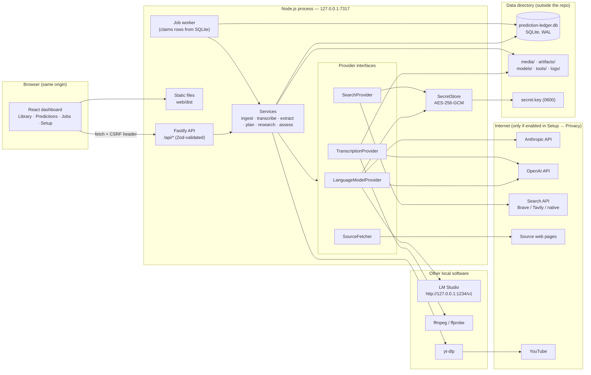
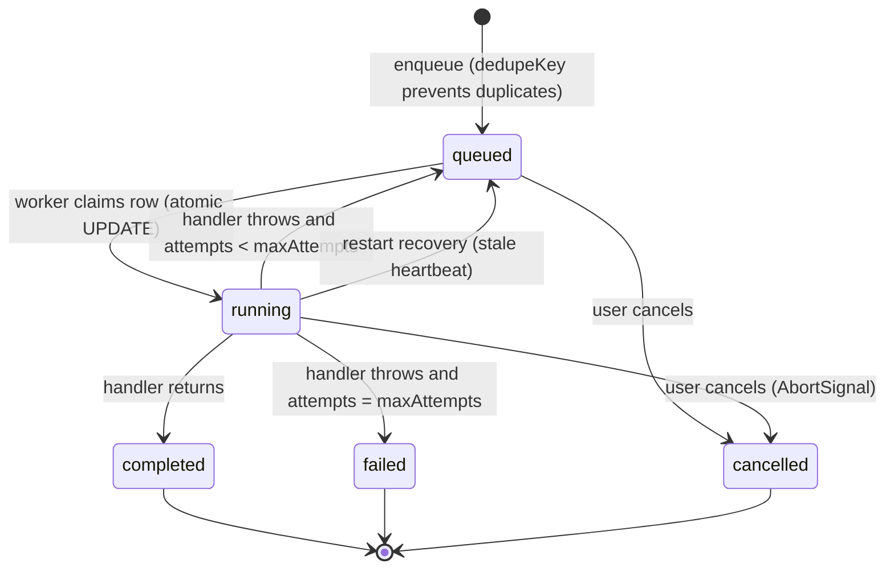
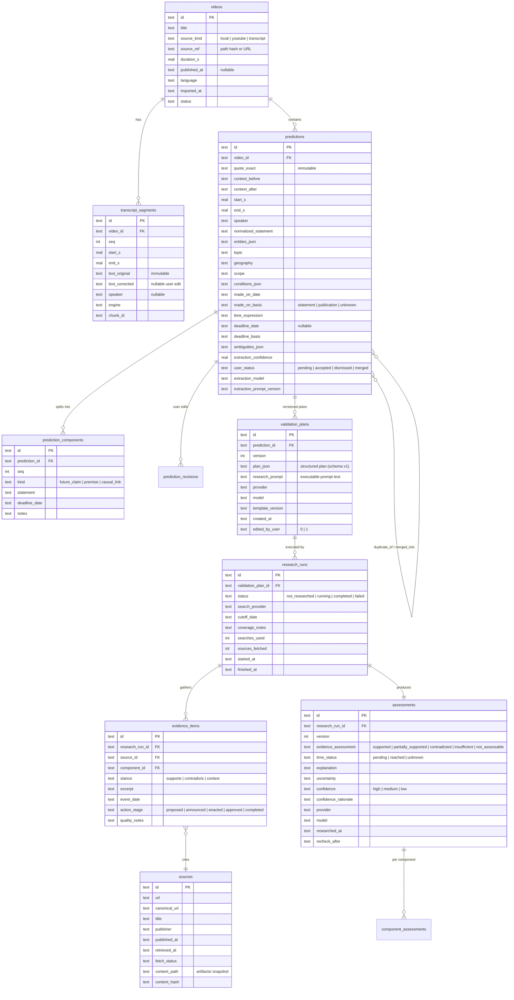

# Prediction Ledger — Architecture Overview v1 (ov1)

| | |
|---|---|
| **Status** | Approved baseline for Release 0.1 → MVP 1.0 |
| **Date** | 2026-09-11 |
| **Original concept** | Michael D. Carter (BitsBeTrippin) |
| **Engineering support** | Claude AI (development lead + agent-role reviews) |
| **Scope** | Localhost-only application. No cloud hosting, no remote database, no telemetry. |

This document is the engineering "map" of Prediction Ledger. It explains what runs, where data lives, how the pieces talk to each other, and why each major choice was made. `docs/BUILD_PLAN.md` explains *when* each piece is built.

---

## 1. What the application does

Prediction Ledger turns a video into an auditable ledger of the predictions it contains and what actually happened afterwards.

```
Import video ─► Transcript ─► Predictions ─► Validation plan ─► Web research ─► Assessment ─► Ledger row
   (file /       (captions /    (LLM          (LLM writes the     (real searches,   (LLM judges     (dashboard:
   YouTube /     Whisper /       extraction,   evaluation          fetched pages,    ONLY the        prediction |
   transcript)   import)         user edits)   criteria BEFORE     stored evidence)  stored          deadline | result
                                               any research)                         evidence)       | explanation | sources)
```

Two rules shape everything downstream:

1. **The evaluation criteria are written before the evidence is gathered, and are versioned.** A research run is always bound to the exact plan version it used. The plan cannot be quietly rewritten to fit the findings.
2. **The model's memory is never evidence.** Only content the application actually retrieved through its own search and fetch adapters can be cited. A search failure produces *insufficient evidence*, never a verdict.

An analogy that holds up well: the app is a **courtroom, not a pundit**. Extraction is the clerk recording what was said; the validation plan is the judge's instructions to the jury written before testimony; research is discovery; assessment is the verdict — and the whole transcript of proceedings is kept.

---

## 2. Application type and stack decision

### 2.1 Options considered

| Option | Fit | Why not chosen as primary |
|---|---|---|
| **A. Node.js + TypeScript, browser dashboard on localhost** *(chosen)* | One runtime for backend, frontend tooling, and job worker. `node:sqlite` is built in (no native compile). Whisper can run in-process via ONNX. yt-dlp accepts Node as its JavaScript runtime. | — |
| B. Python backend (FastAPI) + browser dashboard | Best-in-class ML tooling (faster-whisper, CTranslate2). | Two runtimes to install and keep in sync on Windows/macOS; Python environment management is the single largest source of "it doesn't run on my machine" for non-developer users. |
| C. Desktop shell (Electron/Tauri) | Native file dialogs, single icon to click. | Adds packaging, code-signing, and auto-update surface that an individual maintainer must carry. Deferred: the browser dashboard can be wrapped later without changing the backend. |

### 2.2 Selected stack (verified against official docs on 2026-09-11)

| Layer | Choice | Version guidance | Notes |
|---|---|---|---|
| Runtime | **Node.js** | ≥ 22.13 required; **24 LTS recommended** (26 enters LTS Oct 2026) | `node:sqlite` is available without flags since 22.13 and is "Release Candidate" stability in 26.8. |
| Language | **TypeScript** (strict) | 5.6+ | Shared types package keeps server and browser contracts identical. |
| HTTP server | **Fastify 5** | | Loopback-only. Schema-validated routes, structured logging with redaction, static file serving. |
| Frontend | **React 18 + Vite 5** | | Built once to static files served by Fastify (normal mode). Vite dev server with `/api` proxy (dev mode). No CSS framework; system fonts; light/dark aware. |
| Database | **SQLite via `node:sqlite`** | | WAL mode, foreign keys on. Forward-only SQL migrations. **Drizzle ORM** (`drizzle-orm/node-sqlite`, officially supported) is adopted in Milestone 1 when the content schema lands; Drizzle-Kit generates the SQL files our runner applies. |
| Validation | **Zod** | 3.x | Every request body and every model response is parsed before use. |
| Jobs | **In-process worker over a SQLite `jobs` table** | | No Redis, no second process. Survives restarts. |
| LLM adapters | Thin `fetch` adapters (R0.1) → **Vercel AI SDK** for structured output (M1) | | The app's own `LanguageModelProvider` interface is the boundary; the SDK is an implementation detail behind it. Model discovery and connection tests stay on plain `fetch` because the SDK does not list models. |
| Transcription | **`@huggingface/transformers` (Transformers.js) running Whisper ONNX in Node** | 3.x | Pure-npm, no Python, no compiled binary. Models download once (~150 MB–1 GB) into the data directory. **whisper.cpp** stays on the roadmap as an optional faster engine. |
| Media | **ffmpeg / ffprobe** | user-installed *or* `ffmpeg-static` npm | Audio extraction/normalization to 16 kHz mono WAV. Not supplied by npm alone unless `ffmpeg-static` is chosen (GPL binary — see THIRD_PARTY_NOTICES). |
| YouTube | **yt-dlp** standalone binary | latest | Requires a JavaScript runtime for full format support — **Node ≥ 20 qualifies**, so no Deno install is needed. Downloaded on first use into the data directory after user consent. |
| Search | **`SearchProvider` adapter**: Brave (first), SearXNG (self-hosted), Tavily, Anthropic native web search, OpenAI native web search | | Brave no longer has a free tier (metered from Feb 2026, $5/1k with $5 monthly credit). Provider-native search costs ~$10/1k searches on both Anthropic and OpenAI. All numbers change; the Setup tab shows the user what will be billed by whom. |
| Page extraction | **@mozilla/readability + linkedom** | | Cleaned article text for evidence; hard limits on size/time; SSRF guard (§7.4). |
| Prompt evaluation | **Promptfoo** (dev-time only) | | Regression suite over labeled fixtures for extraction, plan generation, and assessment; not shipped in the runtime. |

### 2.3 Tradeoffs accepted

- **CPU-only Whisper in Node is slower than native whisper.cpp** (roughly real-time to 3× real-time on a laptop for `whisper-base`). Accepted for MVP because it removes an entire class of install failures; users with long videos can use YouTube captions or the OpenAI transcription API, and whisper.cpp can be added as an engine later without schema changes.
- **`node:sqlite` is RC, not final.** Accepted because the API surface we use (`DatabaseSync.exec/prepare/run/get/all`) has been stable across 22→26, and the wrapper in `server/src/db/index.ts` isolates the driver.
- **Fastify + React + Vite is more machinery than a hand-rolled server** — but it is the machinery an individual maintainer can find answers for, and it is what the project's implementation context specifies.

---

## 3. Component and process view



**Process boundaries.** There is exactly one long-lived process the application owns: the Node server. ffmpeg and yt-dlp are short-lived child processes spawned with argument arrays (never a shell string). LM Studio is a separate program the user runs; the app only talks to it over HTTP on an address the user typed into Setup.

**Communication paths.** Browser ↔ server is same-origin HTTP/JSON (long operations are polled through `/api/jobs/:id`; a Server-Sent-Events stream for live progress is planned for Milestone 3). Server ↔ providers is outbound HTTPS or loopback HTTP. Nothing listens on anything except `127.0.0.1`.

---

## 4. Runtime modes and lifecycle

### 4.1 Normal mode (`npm start`)

`scripts/start.mjs` → spawns `node server/dist/index.js` → server applies migrations, starts the job worker, binds `127.0.0.1:7317` (walks forward to 7326 if busy; never kills other processes), prints `PREDICTION_LEDGER_READY http://127.0.0.1:7317` → launcher opens the default browser → Ctrl+C sends SIGINT → worker aborts running jobs (they are re-queued on next start), Fastify closes, SQLite closes.

### 4.2 Development mode (`npm run dev`)

`tsx watch` runs the server from source with `PL_DEV=1`; Vite serves the dashboard on `127.0.0.1:5173` and proxies `/api`. Same data directory as normal mode unless `PL_DATA_DIR` is set.

### 4.3 Environment variables (the only out-of-band configuration)

| Variable | Default | Purpose |
|---|---|---|
| `PL_PORT` | `7317` | First port to try. |
| `PL_DATA_DIR` | OS app-data folder (§5.1) | Where the database, media, models, tools, and logs live. |
| `PL_LOG_LEVEL` | `info` | Fastify/pino level. |
| `PL_NO_OPEN` | unset | `1` = don't open the browser on start. |
| `PL_DEV` | unset | Set by `npm run dev`; enables the Vite origin in the CSRF allow-list. |

Everything else (API keys, models, limits) is configured in the Setup tab and stored in the database.

### 4.4 Upgrades

`git pull` (or download a release) → `npm run setup` → `npm start`. Migrations are forward-only and run automatically at startup; before applying any pending migration the server copies `prediction-ledger.db` to `backups/<timestamp>.db` (Milestone 1). User data is never inside the repository, so upgrading the code cannot touch it.

### 4.5 Durable job lifecycle



Job kinds (added release by release): `video.import`, `audio.extract`, `transcript.generate`, `prediction.extract`, `plan.generate`, `research.run`, `assessment.run`. Every job records progress (0–100) and a human stage label ("Transcribing chunk 3 of 12") that the dashboard shows verbatim.

---

## 5. Data

### 5.1 Data directory (never inside the repo)

| OS | Location |
|---|---|
| Windows | `%LOCALAPPDATA%\PredictionLedger\` |
| macOS | `~/Library/Application Support/PredictionLedger/` |
| Linux | `$XDG_DATA_HOME/prediction-ledger/` or `~/.local/share/prediction-ledger/` |

```
PredictionLedger/
├── prediction-ledger.db      SQLite database (+ -wal, -shm while running)
├── secret.key                32-byte key protecting stored API keys (owner-only permissions)
├── media/                    imported/copied video files (by content hash)
├── artifacts/                extracted audio, transcript chunks, fetched page snapshots
├── models/                   Whisper ONNX models (downloaded once)
├── tools/                    yt-dlp binary (downloaded once, after consent)
├── backups/                  pre-migration database copies
└── logs/                     rolling server logs (secrets redacted)
```

### 5.2 Target schema (entity view)

Release 0.1 ships `settings`, `secrets`, `jobs`, `schema_migrations`. The content tables below arrive with their milestones; this is the agreed target so that early decisions do not paint later ones into a corner.



Design rules baked into the schema:

- **Immutability where it matters.** `predictions.quote_exact` and `transcript_segments.text_original` are never updated; corrections live in `text_corrected` and `prediction_revisions`.
- **Every assessment is traceable** to a prediction version, a plan version, a research run (hence an evidence set), a provider/model, and a research date.
- **Deletion is cascading and explicit.** Deleting a video deletes its segments, predictions, plans, runs, evidence links, and media/artifact files; `sources` rows are reference-counted and removed when orphaned.
- **Exports** (JSON, CSV) come from these tables only; `secrets` is never joined into an export path.
- **Indexes**: `(video_id, seq)` on segments; `(video_id, user_status)` and `deadline_date` on predictions; `(prediction_id, version)` unique on plans; `(status, created_at)` on jobs; `canonical_url` unique on sources.
- **1.11 additions (migration 013).** `videos`: `channel_id`, `published_precision`, `first_seen_at`, `transcript_hash`, `subscription_id`. `predictions`: `quote_hash`, `transcript_hash`, `analysis_version`. `sources`: `first_seen_at`, `status` (`available|withdrawn|missing`), `status_changed_at`, `status_note`, `independence_group`, `last_checked_at`, `last_http_status`. `research_runs`: `purpose` (`verdict|forecast`), `cutoff_at`. New tables `source_subscriptions` (unique canonical `url`), `subscription_runs`, `contract_verifications` (unique `(link_id, version)`; status CHECK; JSON checklist and facts; rules/quote hashes; stale fields); `prediction_market_links.verification_status` (default `unverified`) and `verification_id`. All additive; earlier rows are backfilled, never rewritten.

### 5.3 Where the "untrusted content" line is

Transcripts, fetched pages, and model-generated plans are all *data*. They are inserted into prompts inside clearly delimited blocks, never concatenated into system instructions, and the application — not the prompt — decides which tools run, how many searches are allowed, and which verdict labels exist. A generated research prompt cannot raise the search budget, reach a new URL class, or add a verdict category.

---

## 6. Provider interfaces and capability matrix

Four interfaces, deliberately separate, so that no code path assumes "a model" can do everything:

```ts
interface LanguageModelProvider { testConnection(); listModels(); complete(req) }        // text ↔ text/JSON
interface TranscriptionProvider { transcribe(audioPath, opts): AsyncIterable<Segment> } // audio → timestamped segments
interface SearchProvider        { search(query, opts): SearchResult[] }                  // query → URLs + snippets
interface SourceFetcher         { fetch(url): { text, title, publishedAt, ... } }         // URL → cleaned page
```

| Capability | Anthropic | OpenAI | LM Studio (local) | Local Whisper | Brave / Tavily | SearXNG (local) |
|---|---|---|---|---|---|---|
| Text completion / JSON output | ✓ (forced tool-use) | ✓ (`response_format`) | ✓ if the loaded model supports JSON mode | — | — | — |
| Model discovery | ✓ `GET /v1/models` | ✓ `GET /v1/models` | ✓ `GET /v1/models` | fixed list | — | — |
| Transcription | — | ✓ `gpt-4o-(mini-)transcribe` | — | ✓ | — | — |
| Web search | ✓ native tool (billed per search) | ✓ native tool (billed per search) | — | — | ✓ | ✓ |
| Works offline | — | — | ✓ | ✓ | — | ✓ (if local index) |
| Sends data off-machine | transcript excerpts, predictions, evidence | same | no | no | queries only | no |

**Stage routing.** Extraction, validation-plan generation, and assessment each pick a provider/model independently (Setup → "Which model does what"). A local model can assess evidence because the app hands it the retrieved excerpts — it never needs internet access itself.

**Provider-native search** (Anthropic/OpenAI web search tools) is treated as a `SearchProvider` whose results are the tool's returned citations. They are stored like any other retrieved evidence, and the app still fetches and snapshots the cited pages where accessible.

### 6.1 Market data and the Polymarket US execution boundary (1.5 → 1.10)

Two more interfaces were added later, and they are deliberately kept apart:

```ts
interface MarketProvider { search(); get(); list(); book(); priceHistory() }               // public venue data → probabilities; never authenticated
interface TradingAdapter { balances(); positions(); openOrders(); cancelOrder() }          // 1.10: signed account READS + targeted cancel; no create/preview
```

| Venue | Provider id | Hosts | Units | Account | Can reach execution? |
|---|---|---|---|---|---|
| Polymarket (international) | `polymarket` | gamma-api / clob .polymarket.com | USDC | none | never (geo-restricted; research only) |
| Manifold | `manifold` | api.manifold.markets | mana (play money) | none | never |
| Polymarket US | `polymarket_us` | gateway.polymarket.us (public) · api.polymarket.us (signed) | USD | optional, key ID + Ed25519 secret | the only one — after the 1.11 → 1.13 gates |

Rules that hold across the whole track (ADR-030/031): records are namespaced by provider and never converted; the `TradingAdapter` is the only code that may hold a venue credential, and it takes the credential per call from the trading service, which is the only holder of the `trading.` secret vault; the official `polymarket-us` SDK is pinned and used as the signed transport only — business logic never imports SDK types; production hosts are fixed in the adapter (base-URL overrides are constructor-only, test-only); the trading mode lives in `trading_policy`, not in settings, so a settings save cannot arm anything; every automated test uses the fake adapter; LLMs never call the adapter (there is no tool for it) and never modify policy. What the adapter *cannot* do in 1.10 is the point: there is no method that creates, previews or modifies an order, so submission is impossible by construction until the release that adds it passes its gate.

### 6.2 Source provenance and the contract-verification boundary (1.11)

1.11 adds the two things later releases consume and nothing that consumes them yet.

```
subscription.poll ──▶ video.import (ordinary) ──▶ transcript_hash ──▶ prediction.extract ──▶ analysis_version, quote_hash
                                                                                   │
research.run (purpose = verdict) ──▶ assessment.run ──▶ verdict                    │
research.run (purpose = forecast) ──▶ evidence only (cutoff_at) ── never chains ───┘
sources: first_seen_at · content_hash · status · independence_group   ──▶ dossier (asOf replay, dissent)
prediction_market_links ──▶ contract_verifications (versioned, computed) ──▶ verification_status on the link
```

- **`analysis/independence.ts`** — pure: content sketch + Jaccard, publisher key, union-find grouping, `knownBy(item, asOf)`. Called by the research handler after fetching; the dossier recomputes from stored hashes when a run predates the column.
- **`analysis/contractVerification.ts`** — pure: `verifyContract({prediction, game?, market, facts?})` → field checklist + derived status + side id + cutoff; `revalidate({previous, market, prediction})` → reasons. No I/O, no SDK types, fixture-tested against exact and near-match contracts.
- **`services/contracts.ts`** — the only writer of `contract_verifications`: `findUsCandidates` (US provider only; pasted event URL), `verifyLink` (new version every time), `revalidateLink` (venue refresh when online → stale with reasons), `invalidateForPrediction` (called from every prediction edit/merge/split route). There is no code path that assigns a status: the routes for that answer 405.
- **`services/subscriptions.ts`** — canonical URL, dedupe, `classifyEntry` (known → lookback → allowlist → budget → queue), `makeSubscriptionPollHandler(ctx, lister)`; the lister is injectable so tests never run yt-dlp.
- **`services/dossier.ts`** — read-only join over evidence, sources, runs and assessments; `asOf` filtering uses `first_seen_at` (publication date only under `assumePublished`).

Trust rules unchanged from §5.3 and §7.6, with two additions: model output in a research run is validated against the fetched pages (an excerpt that appears in no page is discarded; an unknown component id is dropped; a missing date stays missing) and has no path to the trading service, the policy row or settings; and a verification is a *precondition record* — it authorizes nothing by itself, and 1.12/1.13 will read it only when `verified_equivalent` and not stale.

---

## 7. Security model

### 7.1 Network exposure
Loopback only (`127.0.0.1`), not configurable. No CORS. Security headers on every response (`nosniff`, `DENY` framing, no referrer). CSP on the dashboard restricts scripts to same-origin.

### 7.2 Secrets
AES-256-GCM per secret, key in `secret.key` (owner-only), plaintext decrypted only for the outbound call, never logged (pino redaction of `authorization`, `x-api-key`, `x-pm-access-key`, `x-pm-signature`, `keyId`, `secretKey`), never in exports, never in the browser (only masked hints like `sk-ant-…4f2a`). Threat model: protects against copied/committed/exported databases; does **not** defend against malware running as the same OS user (same boundary as an OS keychain for an unsigned app). OS-keychain backing is a deferred enhancement.

**Protected namespace (1.10).** Names under `trading.` are refused by `SecretStore.get/set/has/hint/delete`; they are reachable only through a `SecretVault` opened once in the composition root and handed to `TradingAccountService`. Model and search adapters receive getters for their own keys and never see the store, so a prompt-injected model or a compromised search adapter has no code path to a venue credential (OPS-01). Every string that leaves the trading adapter is passed through `redactSecrets` with the live key material and the venue's header shapes before it is stored, returned or logged. **Portable backups** scrub `trading.*` secrets and live authorization from the copy (OPS-02); the raw data-directory copy and pre-migration copies still contain the ciphertext and keep their documented sensitivity. On Windows the protection of `secret.key` is the per-user `%LOCALAPPDATA%` ACL — verified by inspection on the owner's machine, not inferred from the POSIX `0600` mode.

### 7.3 Browser request protections
Mutating requests require the custom header `x-prediction-ledger: 1` (cross-origin pages cannot add it without a preflight we never approve) and, when present, an `Origin` matching our own. Localhost is not treated as trusted.

### 7.4 Outbound URL fetching (research)
`SourceFetcher` resolves DNS first and refuses private, loopback, link-local, and metadata ranges (10/8, 172.16/12, 192.168/16, 127/8, 169.254/16, ::1, fc00::/7); re-checks on every redirect; caps at 5 MB and 20 s; only `http`/`https`; strips credentials from URLs; identifies itself with a fixed User-Agent. **Explicitly configured local endpoints** (LM Studio, SearXNG) are a separate allow-list used only by the provider adapters — research URLs never inherit it.

### 7.5 Uploads and media
Uploaded files are written under `media/` with a generated name (content hash), never the client-supplied path. Container/codec is verified with `ffprobe` before any processing. ffmpeg and yt-dlp are spawned with argument arrays; user-controlled strings are never interpolated into a shell. Size limits and allowed extensions are enforced server-side.

### 7.6 Untrusted content
See §5.3. Additionally, model outputs are parsed with Zod; anything that fails validation is retried once with the validation error appended, then stored as a *malformed output* failure the user can see and retry — never silently accepted.

---

## 8. Dependency evaluation register

Each dependency is adopted only after this table has a row (project rule). "Adopt in" points at the release; licenses are recorded in `THIRD_PARTY_NOTICES.md` when adopted.

| Dependency | Purpose | License | Install requirement | Known limitations | Decision |
|---|---|---|---|---|---|
| fastify, @fastify/static | HTTP server, static files | MIT | npm | — | **Adopted R0.1**. Uploads use a raw octet-stream body (ADR-016), so `@fastify/multipart` was not adopted. |
| zod | Validation | MIT | npm | — | **Adopted R0.1** |
| react, react-dom, vite, @vitejs/plugin-react | Dashboard | MIT | npm (build-time) | — | **Adopted R0.1** |
| drizzle-orm (`/node-sqlite`), drizzle-kit | Typed schema/queries, migration generation | Apache-2.0 | npm | node:sqlite driver is newer than the better-sqlite3 one; verify on Windows in M1 | **Adopt M1** (spike S-1) |
| ai (Vercel AI SDK), @ai-sdk/anthropic, @ai-sdk/openai, @ai-sdk/openai-compatible | Structured output across providers | Apache-2.0 | npm | `generateObject` with OpenAI-compatible servers depends on the local model honouring JSON mode; fall back to prompt-and-parse | **Adopt M1** (spike S-2) |
| @huggingface/transformers | Local Whisper (ONNX) | Apache-2.0 | npm; downloads `onnx-community/whisper-*` models (Apache-2.0/MIT) on first use | CPU-bound; WebGPU in Node is experimental; long files must be chunked (30 s windows with 5 s overlap) | **Adopted R0.4 as an optional dependency** (ADR-016); spike S-3 pending first real run |
| ffmpeg-static *or* system ffmpeg | Audio extraction | GPL-2+/LGPL (binary) | npm downloads platform binary, or user installs | GPL notice required if bundled; system install preferred on macOS via Homebrew | **Adopted R0.4** — system ffmpeg by default (`PL_FFMPEG_PATH` → `ffmpeg-static` → PATH) |
| yt-dlp | YouTube captions/audio | Unlicense | standalone binary downloaded to `tools/` after consent | Needs a JS runtime (Node qualifies); YouTube changes break it periodically → self-update path required; some videos need cookies/PO tokens and remain unavailable | **Adopted R0.5** (ADR-017): consent-installed, SHA-256 verified, `--js-runtimes node`; live confirmation = spike S-4 |
| @mozilla/readability + linkedom | Evidence page extraction | Apache-2.0 / MIT | npm | paywalls and JS-rendered pages yield thin text → recorded as access limitation | **Deferred to 1.0** — 0.3 ships a built-in extractor (ADR-014) |
| Brave Search API | Search adapter #1 | commercial API | key in Setup | metered billing; attribution required for monthly credit | **Adopted 0.3** (plain fetch adapter) |
| SearXNG | Self-hosted search adapter | AGPL-3.0 (server, not linked) | user runs it (Docker or pip) | quality varies by engines configured | **Adopted 0.3** (optional, local) |
| promptfoo | Prompt regression evals | MIT | npm dev-dependency | dev-time only | **Adopt M5** |
| whisper.cpp | Faster native transcription | MIT | compiled binary per platform | packaging burden | **Deferred** (post-MVP engine) |
| GPT Researcher | Reference only | Apache-2.0 | — | Python; used as a design reference for the search→read→cite loop, not a dependency | **Reference** |

---

## 9. Windows / macOS notes

| Concern | Windows | macOS |
|---|---|---|
| Data dir | `%LOCALAPPDATA%\PredictionLedger` | `~/Library/Application Support/PredictionLedger` |
| Open browser | `cmd /c start "" <url>` | `open <url>` |
| `secret.key` protection | per-user `LOCALAPPDATA` ACL (no POSIX mode) | `0600` |
| ffmpeg | `winget install Gyan.FFmpeg` or bundled `ffmpeg-static` | `brew install ffmpeg` |
| yt-dlp | `yt-dlp.exe` downloaded to `tools/` | `yt-dlp_macos` downloaded to `tools/`; first run may require Gatekeeper approval (documented) |
| Path handling | `node:path` everywhere; spaces/Unicode in `LOCALAPPDATA` handled | case-insensitive APFS by default — content-hash file names avoid collisions |
| Shell in npm scripts | all scripts are Node files (`scripts/*.mjs`), no bash/PowerShell required | same |
| Apple Silicon | n/a | Node and ONNX Runtime ship arm64 builds; no Rosetta needed |

---

## 10. Risks and feasibility spikes

| ID | Risk | Spike / mitigation | Owner |
|---|---|---|---|
| S-1 | Drizzle + `node:sqlite` on Windows | 1-day spike at M1 start; fallback is our plain SQL layer (already working) | AG-11 |
| S-2 | Structured output from small local models | Evaluate `generateObject` vs. prompt-and-parse with Zod repair loop on 3 LM Studio models | AG-13 |
| S-3 | Whisper-in-Node throughput and memory for a 30-min file | Measure `whisper-base` and `whisper-small` on CPU; set default model and chunk sizes from data | AG-05 |
| S-4 | yt-dlp breakage cadence | Self-update command in Setup; captions-first strategy; transcript import is always available | AG-13 |
| S-5 | Search provider economics | Show per-run cost estimate in UI; hard budget per run from Setup | AG-03 |
| S-6 | Model output drift across provider updates | Promptfoo suite with labeled fixtures run before each release | AG-14 |

---

## 11. Agent register for this baseline

| Agent | Status | Assignment |
|---|---|---|
| AG-01 Development Lead | Active | This document, BUILD_PLAN, integration |
| AG-02 Solution Architect | Active | Stack selection (§2), boundaries (§3, §7), dependency register (§8) |
| AG-03 Product/Requirements | Active | Requirement IDs and acceptance criteria (BUILD_PLAN §2, §4) |
| AG-05 TS/Node Engineer | Active | Server skeleton, provider adapters, job queue |
| AG-06 NPM/Build | Active | Workspaces, scripts, lockfile policy |
| AG-07 Local Web Server | Active | Loopback binding, port walk, ready line, shutdown |
| AG-08 Windows / AG-09 macOS | On demand | Static review §9; live verification at each release |
| AG-10 UX/Frontend | Active | Setup tab, wireframes (docs/WIREFRAMES.md) |
| AG-11 Local Data | Active | Schema (§5), migrations, backups |
| AG-13 API/Integration | Active | Provider matrix (§6), search/fetch adapters |
| AG-14 Quality | Active | Core tests (R0.1), fixtures and Promptfoo (M5) |
| AG-15 Security | Active | §7 baseline review; deeper review at M2 (fetching) and M3 (uploads/child processes) |
| AG-16 Docs/DX | Active | README, SETUP, troubleshooting |
| AG-04 Python, AG-12 Packaging, AG-17 Specialist | Inactive | Not needed for MVP (Python avoided by design; packaging deferred) |

The roles above were applied as structured review perspectives within one working session; no independent agent processes ran for this baseline.
