# Prediction Ledger — Build Plan and Release Schedule to MVP

| | |
|---|---|
| **Baseline** | Architecture ov1 (`docs/ARCHITECTURE.md`) |
| **Current release** | 0.1 — Foundation (this repository state) |
| **MVP target** | 1.0 — end-to-end: video → predictions → plan → research → verdict, on Windows and macOS |
| **Original concept** | Michael D. Carter (BitsBeTrippin) · Engineering support: Claude AI |

The plan follows the milestone order from the project's implementation context: get the *analysis* pipeline working on an imported transcript first (highest value, fewest moving parts), then evidence and verdicts, then local video transcription, then YouTube, then cross-provider evaluation and packaging.

---

## 1. Release map

```mermaid
gantt
  title Releases to MVP (sequence, not calendar commitments)
  dateFormat X
  axisFormat %s
  section Foundation
  0.1 Localhost server + Setup tab            :done, r01, 0, 1
  section Milestone 1
  0.2 Transcript import → predictions → plans :r02, after r01, 2
  section Milestone 2
  0.3 Research → evidence → assessments       :r03, after r02, 2
  section Milestone 3
  0.4 Local video → timestamped transcription :r04, after r03, 2
  section Milestone 4
  0.5 YouTube ingestion + recovery paths      :r05, after r04, 1
  section Milestone 5
  1.0 Cross-provider evals, hardening, docs   :r10, after r05, 1
```

| Release | Theme | User can… | Depends on |
|---|---|---|---|
| **0.1** | Foundation | Install with npm, start a loopback server, open the dashboard, enter and test Anthropic / OpenAI / LM Studio credentials, save limits and privacy settings. | — |
| **0.2** | Milestone 1 — Analysis core | Import a transcript (SRT/VTT/TXT/JSON), extract predictions, review/edit/merge/split/dismiss them, and generate + inspect + edit a versioned validation plan per prediction. | 0.1 |
| **0.3** | Milestone 2 — Research & verdicts | Run real web research against a plan, see stored evidence with citations, get a two-field verdict (evidence assessment + time status), recheck to create a new version, export JSON/CSV. | 0.2 |
| **0.4** | Milestone 3 — Local video | Drag-drop an MP4/MPEG, get audio extracted and transcribed locally (Whisper) or via OpenAI, watch chunked progress, read a timestamped transcript on the video page. | 0.1 (+0.2 to analyse it) |
| **0.5** | Milestone 4 — YouTube | Paste a URL: captions first, audio download + transcription second, transcript import as the documented fallback; clear errors for unavailable content. | 0.4 |
| **1.0** | Milestone 5 — MVP | Promptfoo regression suite over labeled fixtures, restart/cancel/rate-limit hardening, Windows and macOS verified, troubleshooting docs, tagged release. | 0.5 |

Post-MVP candidates (not scheduled): whisper.cpp engine, OS-keychain secrets, SSE live progress, desktop shell (Tauri), live broadcast ingestion, multi-language UI.

---

## 2. Requirements register (stable IDs)

IDs are stable; wording may be refined. "Rel." is the release that first satisfies the requirement.

### Runtime & installation
| ID | Requirement | Rel. |
|---|---|---|
| RT-01 | Runs from `npm run setup` + `npm start` on Windows and macOS with Node ≥ 22.13 (24 LTS recommended); no admin rights, no Docker. | 0.1 |
| RT-02 | Server binds `127.0.0.1` only; occupied port handled by walking forward with a clear message; never kills other processes. | 0.1 |
| RT-03 | User data stored outside the repo in the OS app-data directory, overridable via `PL_DATA_DIR`. | 0.1 |
| RT-04 | Forward-only migrations applied at startup with a pre-migration backup. | 0.1 (backup 0.2) |
| RT-05 | External binaries (ffmpeg, yt-dlp) and model downloads are documented and detected/downloaded explicitly — never implied by npm. | 0.1 doc / 0.4 / 0.5 |
| RT-06 | Clean shutdown on Ctrl+C: running jobs re-queued, DB closed. | 0.1 |
| RT-07 | Dev mode (`npm run dev`) separate from normal mode. | 0.1 |

### Setup & providers
| ID | Requirement | Rel. |
|---|---|---|
| SP-01 | Configure Anthropic, OpenAI, and LM Studio (URL, model, optional key). | 0.1 |
| SP-02 | Connection test per provider with actionable errors (unauthorized / unreachable / no model loaded / rate-limited / offline mode). | 0.1 |
| SP-03 | Model discovery where supported, manual model id always allowed. | 0.1 |
| SP-04 | Different provider/model per stage: extraction, plan generation, assessment. | 0.1 (routing) / 0.2 (used) |
| SP-05 | Transcription engine selection with separate settings. | 0.1 (stored) / 0.4 (used) |
| SP-06 | Search provider selection incl. provider-native search; key stored encrypted. | 0.1 (stored) / 0.3 (used) |
| SP-07 | Concurrency, request-rate, and research budgets. | 0.1 (stored) / 0.3 (enforced) |
| SP-08 | Privacy switch: internet off ⇒ only local endpoints used; research stays *pending*. | 0.1 |
| SP-09 | Four distinct interfaces: LanguageModelProvider, TranscriptionProvider, SearchProvider, SourceFetcher. | 0.1 / 0.4 / 0.3 / 0.3 |
| SP-10 | Prompt templates viewable with optional user overrides (versioned). | 0.2 |

### Ingestion & transcription
| ID | Requirement | Rel. |
|---|---|---|
| IN-01 | Transcript import (SRT, VTT, plain text with optional timestamps, JSON). | 0.2 |
| IN-02 | Local MP4/MPEG import by file picker and drag-drop; validated with ffprobe. | 0.4 |
| IN-03 | Audio extraction/normalization to 16 kHz mono; chunked transcription with overlap; timestamps continuous across chunks. | 0.4 |
| IN-04 | Progressive segment persistence and visible progress; interrupted jobs resume. | 0.4 |
| IN-05 | Video metadata: title, source ref, duration, publish date (if known), language, import date. | 0.2 (partial) / 0.4 |
| IN-06 | Original transcript immutable; user corrections stored separately. | 0.2 |
| IN-07 | YouTube: captions → audio (yt-dlp) → manual transcript fallback; unavailable/private/age-gated content reported clearly. | 0.5 |
| IN-08 | Silent audio, unsupported codec, and transcription errors produce recoverable, explained failures. | 0.4 |

### Prediction extraction
| ID | Requirement | Rel. |
|---|---|---|
| PX-01 | Extract future-oriented claims; exclude history, questions, wishes, hypotheticals, quoted third-party views. | 0.2 |
| PX-02 | Store exact quotation + context, timestamps, speaker (or unknown), normalized statement, entities, topic, geography, scope, conditions, thresholds, ambiguities, confidence. | 0.2 |
| PX-03 | Prediction date + basis; relative deadlines resolved from statement date (publication date as recorded proxy); never invent dates or geography. | 0.2 |
| PX-04 | Preserve modality ("might" stays "might"). | 0.2 |
| PX-05 | Split compound predictions into components: future claim / premise / causal link; parent retained. | 0.2 |
| PX-06 | Cross-chunk deduplication that keeps every original occurrence. | 0.2 |
| PX-07 | User can edit, merge, split, accept, dismiss; edits stored as revisions. | 0.2 |
| PX-08 | Malformed model output is validated, retried once with the error, then surfaced — never silently accepted. | 0.2 |

### Validation plan
| ID | Requirement | Rel. |
|---|---|---|
| VP-01 | Distinct, inspectable step: "Create a research prompt and evaluation plan… do not determine the outcome yet." | 0.2 |
| VP-02 | Structured plan: proposition, components/conditions, dates (made/deadline/cutoff), definitions & ambiguities, supporting evidence, contradicting evidence, partial-fulfilment criteria, neutral/supporting/disconfirming queries, preferred source types, executable prompt, output schema. | 0.2 |
| VP-03 | Plan versions immutable; edits create a new version; provider/model/template version/timestamp recorded. | 0.2 |
| VP-04 | Auto-continue by default; optional "review before research" mode. | 0.3 |

### Research & evidence
| ID | Requirement | Rel. |
|---|---|---|
| RS-01 | Only application-executed searches and fetches count as evidence. | 0.3 |
| RS-02 | Supporting, contradicting, and alternative-explanation searches; budgets enforced. | 0.3 |
| RS-03 | Evidence record: source id, URL, title, publisher, dates, retrieval time, excerpt, component addressed, stance, access limitations, quality notes. | 0.3 |
| RS-04 | Action-stage distinction: proposed / announced / enacted / approved / completed. | 0.3 |
| RS-05 | In-window vs. later developments reported separately. | 0.3 |
| RS-06 | Research cutoff and coverage limitations recorded; failures never become verdicts. | 0.3 |
| RS-07 | Outbound fetch guarded against private networks, redirects, size/time. | 0.3 |

### Verdicts
| ID | Requirement | Rel. |
|---|---|---|
| VD-01 | Two independent fields: evidence assessment (5 values) and time status (3 values); processing status separate. | 0.3 |
| VD-02 | Component-level assessments with explained overall assessment; no invented percentage score. | 0.3 |
| VD-03 | Result = assessment, time status, 2–4 sentence explanation, citations tied to claims, supporting/contradicting evidence, remaining uncertainty, confidence with rubric, research date, recheck date. | 0.3 |
| VD-04 | Recheck creates a new assessment version; history preserved. | 0.3 |

### Dashboard
| ID | Requirement | Rel. |
|---|---|---|
| UX-01 | Video library with import controls and empty states. | 0.2 |
| UX-02 | Video detail page: metadata + timestamped transcript. | 0.2 / 0.4 |
| UX-03 | Predictions table grouped by video: Prediction · Deadline · Result · Time status · Brief explanation · Sources · Last checked. | 0.2 (partial) / 0.3 |
| UX-04 | Detail panel: quotation + timestamp, normalized claim + components, validation prompt, evidence, history, edit/research/retry/recheck. | 0.2 / 0.3 |
| UX-05 | Filters by video, topic, result, deadline. | 0.3 |
| UX-06 | Progress stages, partial results, recoverable errors; no technical config in the review flow. | 0.2+ |
| UX-07 | Setup tab. | 0.1 |

### Persistence, reliability, security
| ID | Requirement | Rel. |
|---|---|---|
| PS-01 | Schema per ARCHITECTURE §5.2 with relationships, indexes, cascading deletes. | 0.2 / 0.3 |
| PS-02 | JSON/CSV export excluding credentials. | 0.3 |
| PS-03 | Durable jobs: restart recovery, bounded retries, cancellation, dedupe. | 0.1 |
| PS-04 | Rate limits and response caching for providers. | 0.3 |
| SC-01 | Secrets encrypted at rest; never in logs, exports, or browser bundles. | 0.1 |
| SC-02 | CSRF header + origin check; no CORS. | 0.1 |
| SC-03 | Upload validation, safe file naming, argument-array child processes. | 0.4 |
| SC-04 | Transcripts, pages, and generated prompts treated as untrusted content. | 0.2+ |

---

## 3. Release 0.1 — Foundation (delivered)

**Objective.** A person can clone the repo, run two commands, and reach a working Setup tab that talks to real providers — proving the runtime, persistence, secrets, job, and security foundations before any AI logic is added.

| Item | Req. | Agent | Done |
|---|---|---|---|
| npm workspaces (`shared`, `server`, `web`) with portable Node scripts (`setup`, `build`, `start`, `dev`, `test`, `clean`) | RT-01, RT-07 | AG-06 | ✓ |
| Fastify server on `127.0.0.1:7317` with port walk, ready line, security headers, graceful shutdown | RT-02, RT-06 | AG-07 | ✓ |
| OS-aware data directory + `PL_DATA_DIR` | RT-03 | AG-05 | ✓ |
| `node:sqlite` wrapper + forward-only SQL migration runner (`001_init.sql`) | RT-04 | AG-11 | ✓ |
| AES-256-GCM `SecretStore`, masked hints, redacted logging | SC-01 | AG-15 | ✓ |
| CSRF header + origin guard | SC-02 | AG-15 | ✓ |
| `LanguageModelProvider` interface; Anthropic (Messages + Models API), OpenAI-compatible adapter shared by OpenAI and LM Studio; connection tests with actionable errors; model discovery | SP-01..03, SP-09 | AG-13 | ✓ |
| Settings service (Zod-validated, merged over defaults); stage routing; transcription/search/limits/privacy stored | SP-04..08 | AG-05 | ✓ |
| Durable `JobQueue` (claim, heartbeat, retry, cancel, dedupe, restart recovery) with no handlers yet | PS-03 | AG-05 | ✓ |
| React Setup tab; placeholder tabs describing upcoming releases | UX-07 | AG-10 | ✓ |
| `node:test` suite for migrations, secrets, job queue | — | AG-14 | ✓ |
| README, ARCHITECTURE ov1, BUILD_PLAN, SETUP (incl. LM Studio), WIREFRAMES, DECISIONS, LICENSE/NOTICE/THIRD_PARTY_NOTICES, CONTRIBUTING | — | AG-16 | ✓ |

**Acceptance criteria for 0.1**

| # | Criterion | How to verify |
|---|---|---|
| A1 | `npm run setup` succeeds on a clean machine with Node 24 and no other tooling. | Fresh clone; run; exit code 0. |
| A2 | `npm start` prints `PREDICTION_LEDGER_READY http://127.0.0.1:7317` and opens the dashboard. | Observe console and browser. |
| A3 | Server is not reachable from another machine on the LAN. | `curl http://<lan-ip>:7317` from another host → connection refused. |
| A4 | With 7317 occupied, the server starts on 7318 and says so; the occupying process is untouched. | Start any listener on 7317 first. |
| A5 | Saving an Anthropic key stores only ciphertext; `GET /api/settings` returns `hasSecret: true` and a masked hint, never the key. | Inspect `secrets` table and API response. |
| A6 | Test connection with a wrong key → "Authentication failed…"; with LM Studio stopped → "Nothing is listening at …"; with LM Studio running and no model loaded → "…no models are loaded…". | Manual. |
| A7 | Privacy → internet off ⇒ testing Anthropic/OpenAI returns the offline-mode message; LM Studio test still works. | Manual. |
| A8 | Settings survive a server restart. | Restart; reload Setup. |
| A9 | A `POST /api/settings` without the CSRF header is rejected with 403. | `curl -X PUT …` without header. |
| A10 | `npm test` passes (migrations, secrets, job queue incl. restart recovery). | Run. |

**Verification status (2026-09-11).** Executed in the cloud build environment: A10 core tests (3/3 pass on Node 22.22 — see `server/src/core.test.ts`), TypeScript compilation of `shared` and of the dependency-free server modules, syntax checks of all `scripts/*.mjs`. **Not executed:** `npm install`/`npm run build`/`npm start` end-to-end, because the build environment's package registry access was blocked and the linked Windows machine's shell was unavailable during this session. A1–A9 therefore remain **pending first run on Carter's Windows machine** (steps in README → "First run checklist"); macOS is **unverified** and awaits a machine.

---

## 4. Release 0.2 — Milestone 1: transcript → predictions → validation plans

**Objective.** The analysis core works end-to-end on an imported transcript, with no media processing in the loop.

| Item | Req. | Agent | Depends on |
|---|---|---|---|
| Spike S-1: Drizzle + `node:sqlite`; adopt or keep plain SQL | PS-01 | AG-11 | — |
| Migration 002: `videos`, `transcript_segments`, `predictions`, `prediction_components`, `prediction_revisions`, `validation_plans`; pre-migration backup | RT-04, PS-01 | AG-11 | S-1 |
| Transcript import: SRT/VTT/TXT/JSON parsers → segments; video record with `source_kind = transcript` | IN-01, IN-05, IN-06 | AG-05 | 002 |
| Spike S-2: structured output via AI SDK vs. prompt-and-parse on Anthropic, OpenAI, and two LM Studio models | SP-04, PX-08 | AG-13 | — |
| `prediction.extract` job: windowed transcript (≈12 min with 2-min overlap) → extraction prompt → Zod-validated predictions; dedupe across windows keeping occurrences | PX-01..06, PX-08 | AG-05 | S-2, 002 |
| Prompt templates (`extraction v1`, `plan v1`) as versioned files with user override in Setup | SP-10 | AG-13 | — |
| `plan.generate` job: prediction + context → structured plan + executable research prompt; versioned; user edit creates v+1 | VP-01..03 | AG-05 | 002 |
| Library page (import transcript, list videos, delete with cascade), video page with transcript | UX-01, UX-02 | AG-10 | 002 |
| Predictions table (grouped by video; Result/Time-status columns show "not researched") + detail panel with quotation, components, plan viewer/editor, accept/dismiss/merge/split | UX-03, UX-04, PX-07 | AG-10 | above |
| Fixtures: 3 human-reviewed transcripts (`fixtures/transcripts/*.json`) with labeled expected predictions incl. the worked example ("data center approvals…") | — | AG-14 | — |
| Tests: parsers; dedupe; date resolution ("within two years" from statement date; unknown date stays unknown); compound split; malformed output retry | — | AG-14 | above |

**Acceptance criteria for 0.2**

| # | Criterion |
|---|---|
| B1 | Importing the 30-minute fixture transcript creates one video and N segments with monotonically increasing timestamps; a prediction whose sentence spans two extraction windows is extracted exactly once with both occurrences recorded. |
| B2 | Importing a transcript with no predictive statements results in an empty predictions list and a visible "No predictions found" state — not an error. |
| B3 | For the worked example, extraction yields a parent prediction with three components (future approval restriction; cancellation premise; causal link), geography flagged ambiguous, deadline = statement date + 2 years with basis recorded; when the transcript carries no date, deadline is *unknown* and no date is invented. |
| B4 | "might" in the source is never rendered as "will" in the normalized statement (fixture check). |
| B5 | A validation plan is generated and stored with provider, model, template version, and time; editing it produces version 2 while version 1 remains readable. |
| B6 | Extraction with a local LM Studio model completes with internet disabled. |
| B7 | A deliberately malformed model response (fixture provider) is retried once, then surfaced as a failed job with the validation error visible and a Retry button. |
| B8 | Killing the server mid-extraction and restarting re-queues the job and it completes without duplicate predictions. |

---

## 5. Release 0.3 — Milestone 2: research → evidence → assessments → dashboard

| Item | Req. | Agent | Depends on |
|---|---|---|---|
| Migration 003: `research_runs`, `sources`, `evidence_items`, `assessments`, `component_assessments` | PS-01 | AG-11 | 0.2 |
| `SearchProvider`: Brave (first), SearXNG, Tavily; provider-native adapters for Anthropic and OpenAI web search | SP-06, RS-01 | AG-13 | — |
| `SourceFetcher`: SSRF guard, redirects, limits, Readability extraction, snapshot to `artifacts/`, canonical URL + syndication detection | RS-07, RS-03 | AG-13 + AG-15 review | — |
| `research.run` job: execute plan queries (neutral/supporting/disconfirming) within budgets; fetch top sources; store evidence with stance, component, action stage, dates; record cutoff and coverage notes | RS-02..06 | AG-05 | above |
| `assessment.run` job: assessment prompt over *stored* evidence only → two-field verdict, component assessments, explanation, citations, uncertainty, confidence rubric, recheck date | VD-01..03 | AG-05 | above |
| Recheck = new run + new assessment version; history view | VD-04 | AG-05 | — |
| Rate limiter + response cache per provider; per-run budget enforcement | PS-04, SP-07 | AG-13 | — |
| Dashboard: full predictions table, filters, evidence panel with source links, assessment history, Research/Retry/Recheck controls; "review plan before research" toggle | UX-03..06, VP-04 | AG-10 | — |
| JSON/CSV export (no credentials) | PS-02 | AG-11 | — |
| Fixtures: labeled evidence sets (synthetic, clearly marked) for supported / contradicted / mixed / insufficient / not-assessable | — | AG-14 | — |

**Acceptance criteria for 0.3**

| # | Criterion |
|---|---|
| C1 | With search provider = none (or internet off), Research leaves the prediction at *not researched / deadline pending|unknown* with an explanatory banner — never *contradicted*. |
| C2 | A search provider outage mid-run yields *insufficient evidence* with coverage notes naming the failed queries; the job is *failed* with Retry available and no assessment row is created. |
| C3 | Mixed-evidence fixture yields *partially supported* with both supporting and contradicting items cited per component; the explanation is 2–4 sentences. |
| C4 | Pending-deadline fixture: time status *deadline pending*; evidence assessment may be *insufficient evidence*; the row never shows a failure. |
| C5 | Worked example: local permit-cancellation evidence alone yields *supported* for the premise component and *insufficient evidence* for the "approvals narrowed to government land" component; overall is *insufficient evidence* or *partially supported* with the reason stated — never *supported*. |
| C6 | Every citation in an assessment resolves to a stored `sources` row retrieved by the app; a model-invented URL is rejected by validation. |
| C7 | A local LM Studio model can produce an assessment from stored evidence with internet disabled after research has run. |
| C8 | Recheck creates assessment version 2; version 1 remains visible in history with its research date. |
| C9 | Exported JSON contains no `secrets` fields; CSV opens in Excel with one row per prediction. |

---

## 6. Release 0.4 — Milestone 3: local video → timestamped transcription

| Item | Req. | Agent | Depends on |
|---|---|---|---|
| Spike S-3: Transformers.js Whisper throughput/memory on a 30-min file; choose default model | IN-03 | AG-05 | — |
| Upload route (`@fastify/multipart`, size limit, extension allow-list), drag-drop UI, ffprobe validation, content-hash storage | IN-02, SC-03 | AG-05 + AG-10 | — |
| `audio.extract` job: ffmpeg (system or `ffmpeg-static`) → 16 kHz mono WAV; silent-audio detection | IN-03, IN-08 | AG-05 | ffmpeg detection in Setup |
| `TranscriptionProvider`: local Whisper (chunked with overlap, timestamp stitching, progressive segment writes, resumable), OpenAI transcription | IN-03, IN-04, SP-05 | AG-05 | S-3 |
| Model download manager (progress, checksum, consent) into `models/` | RT-05 | AG-05 | — |
| Jobs tab with live progress; video page shows transcript as it arrives | UX-06 | AG-10 | — |
| Windows + macOS verification of ffmpeg detection and child-process spawning | RT-05 | AG-08, AG-09 | — |

**Acceptance criteria for 0.4**

| # | Criterion |
|---|---|
| D1 | A 30-minute MP4 transcribes locally with continuous timestamps (no gap or overlap > 1 s at chunk boundaries) and segments appear progressively. |
| D2 | Interrupting the server at chunk k and restarting resumes from chunk k (no re-transcription of completed chunks, no duplicate segments). |
| D3 | A file with no audio track, an unsupported codec, or 30 minutes of silence each produce a distinct, recoverable error message. |
| D4 | Uploading `../../evil.mp4` (path traversal name) stores the file under a hash name inside `media/`. |
| D5 | With ffmpeg absent, import fails before upload finishes, with install instructions per OS. |

---

## 7. Release 0.5 — Milestone 4: YouTube ingestion and recovery paths

| Item | Req. | Agent | Depends on |
|---|---|---|---|
| Spike S-4: yt-dlp download/self-update strategy using Node as the JS runtime; caption formats | IN-07 | AG-13 | — |
| yt-dlp acquisition into `tools/` after explicit consent; version pin + "update yt-dlp" button | RT-05 | AG-05 | — |
| `video.import` (YouTube): metadata → captions (manual > auto) → else audio download → transcription; every step reports what it will send off-machine | IN-05, IN-07 | AG-05 | 0.4 |
| Unavailable/private/age-restricted/geo-blocked → clear message + "import transcript instead" path | IN-07 | AG-10 | — |

**Acceptance criteria for 0.5**

| # | Criterion |
|---|---|
| E1 | A public video with captions imports without downloading audio; publish date and title are captured. |
| E2 | A public video without captions falls back to audio + transcription with visible stages. |
| E3 | A private or removed video yields "unavailable" with the transcript-import fallback offered; no job is left *running*. |
| E4 | With internet disabled, pasting a URL is refused up front with the privacy setting named. |

---

## 8. Release 1.0 — Milestone 5: cross-provider evaluation, hardening, MVP

| Item | Req. | Agent |
|---|---|---|
| Promptfoo suite: extraction, plan generation, assessment over labeled fixtures across Anthropic, OpenAI, and one local model; thresholds recorded | — | AG-14 |
| Hardening: rate-limit backoff, provider timeouts, cancellation everywhere, log rotation, backup/restore commands | PS-03, PS-04 | AG-05 |
| Security pass: dependency audit, fetch guard tests, upload fuzzing, secrets-in-logs scan | SC-* | AG-15 |
| Windows and macOS verification matrix executed and recorded (`docs/VERIFICATION.md`) | RT-01 | AG-08, AG-09, AG-14 |
| README/SETUP/TROUBLESHOOTING final pass; release notes; `v1.0.0` tag | — | AG-16 |

**MVP acceptance (cumulative).** All 0.1–0.5 criteria plus: invalid-credential handling at every stage (job fails with the provider's message, never silent); local-model-only operation for extraction, plans, and assessment; malformed output handling at every model call; restart recovery for every job kind.

---

## 9. Working agreements

- **Small end-to-end increments.** Each release is usable on its own; nothing is merged that leaves the dashboard in a half-state.
- **Fixtures first.** Every new model-facing feature ships with a human-reviewed fixture before it ships with a prompt tweak.
- **The plan is a contract.** Verdict labels, budgets, and tool access are set by code and settings; prompts and fetched content cannot change them.
- **Docs move with code.** A release is not done until README/SETUP match the commands that actually work.
- **Verification is reported honestly.** "Tested on Windows" and "statically reviewed for macOS" are different sentences and both get written.
